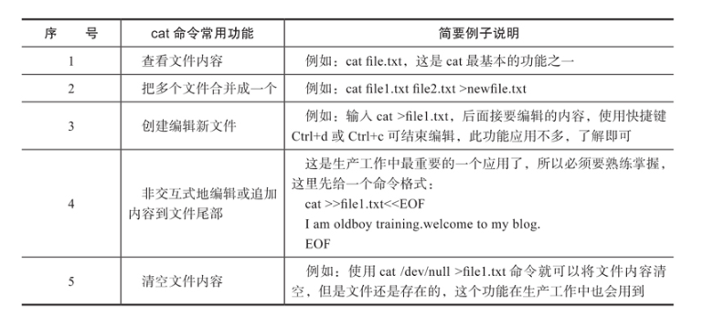
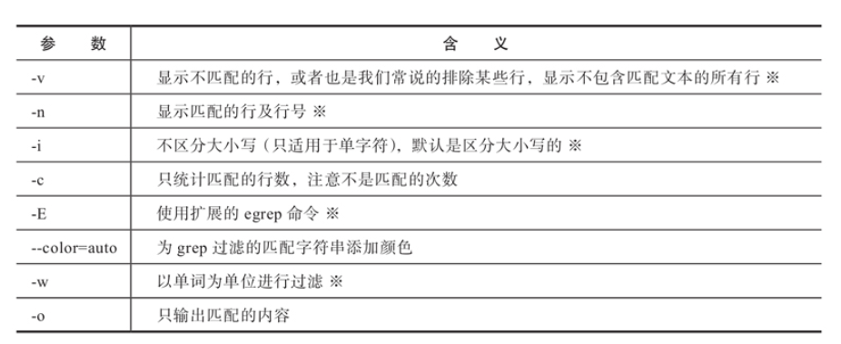
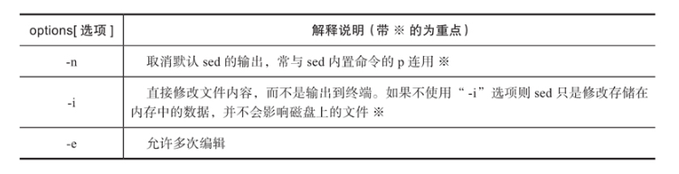
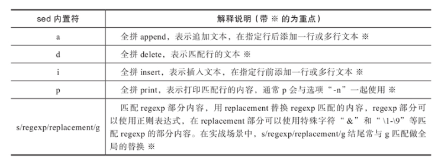
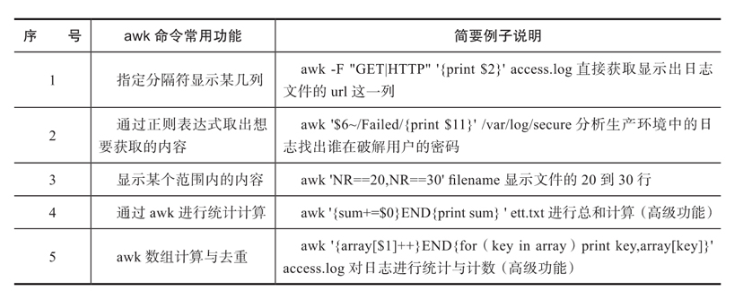
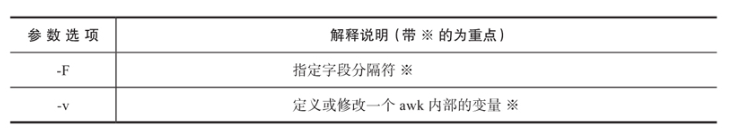
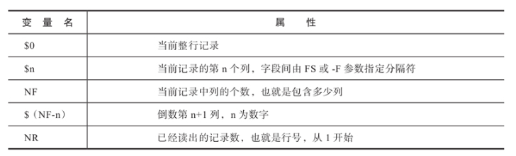
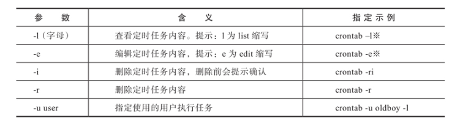
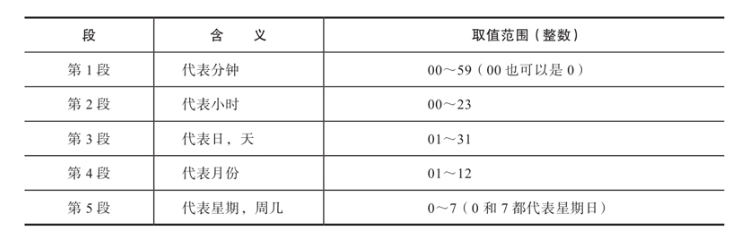
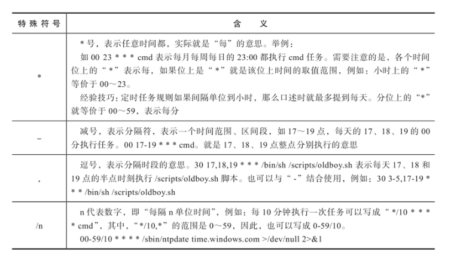

## Linux运维常用命令

### 1. 文本操作

#### cat命令

cat命令可以理解为英文单词concatenate的缩写，其功能是连接多个文件并且打印到屏幕输出，或者重定向到指定文件中。

此命令常用于显示单个文件内容，或者将几个文件内容连接起来一起显示，还可以从标准输入中读取内容并显示，生产环境中，它常与重定向或追加符号配合使用。

执行cat的完整命令生成test.txt文件内容

~~~SHELL
cat >test.txt<<EOF # 此处必须使用两个小于号，EOF表示结束标记，既读到EOF就结束
> hello world
> linux centos
> EOF # EOF必须成对出现，也可以使用其他的成对标签替换，结尾的EOF必须定格编写
~~~

以上就是cat命令在生产环境中常用的非交互式编辑文件的方法，如果内容中包含$符号时要用“\”符号进行转义。

#### echo命令

echo命令能将指定文本显示在Linux命令行上，或者通过重定向符写入到指定的文件中。

~~~shell
echo hello # 直接输出文本
echo 'hello' # 解压使用引号将内容括起来，单引号，双引号均可
echo -e "hello\tworld" #使用-e可以识别特殊字符
~~~

echo可以配合重定向符将内容输入到文件

- “>”为重定向符号，表示清除原文件里面的所有内容，然后将内容追加到文件的末尾

- “>>”为追加重定向符号，即追加内容到文件的尾部（文件的最后一行）。

将文本追加到某个文件中。

~~~shell
echo "hello world" >>hello.txt #文件会被自动创建
~~~

#### grep命令 

grep命令是Linux系统中最重要的命令之一，其功能是从文本文件或管道数据流中筛选匹配的行及数据，如果配合正则表达式技术一起使用，则功能会更加强大，它是Linux运维人员必须要掌握的命令之一。

grep命令里面的匹配模式，都是你要获取的内容，它们既可以是普通的文字符号也可以是正则表达式，其语法格式

~~~shell
grep option pattern file
#     参数     模式   文件
~~~

grep命令的常用参数

测试文件

~~~shell
cat test.txt
zhangsan
lisi
wangwu
~~~

使用grep过滤不包含lisi字符串的行（-v参数）

~~~shell
grep -v "lisi" test.txt
# grep的-v参数的作用是排除，默认是以行为单位排除包含参数后面所接内容的某些行。
~~~

使用grep命令显示过滤后的内容的行号

~~~shell
grep -n "wangwu" test.txt
~~~

-i不区分大小写

~~~shell
grep -i "WANGWU" test.txt
~~~

同时过滤两个不同的字符串

~~~shell
grep -E "zhangsan|lisi" test.txt
~~~

计算匹配的字符串的数量

~~~shell
grep -c "zhangsan" test.txt
~~~

过滤包含字母a的行

~~~shell
grep ".*a.*" test.txt
~~~

#### sed：流编辑器

sed是Stream Editor（字符流编辑器）的缩写，简称流编辑器。

ed是操作、过滤和转换文本内容的强大工具。sed的常用功能包含对文件实现快速增删改查（增加、删除、修改、查询），其中查询的功能中最常用的两大功能是过滤（过滤指定字符串）和取行（取出指定的行）。

语法格式

~~~
sed [选项] [sed内置命令字符] [输入文件]
~~~

sed命令的参数选项

sed的内置命令字符可用来实现对文件的不同操作功能，例如对文件的增删改查等

测试文件内容

~~~shell
cat  test.txt
I am zhangsan
I like badminton ball,billiard ball and chinese chess
my site is http://www.zhangsan.com
my telphone is 123456
~~~

输出test.txt第2-3行的内容

~~~shell
sed -n '2,3p' test.txt # -n取消默认输出，利用p控制显示的行
~~~

过滤出含有zhangsan字符串的行，sed命令的过滤功能，类似于grep的过滤，不同的是需要用双斜线将需要过滤的字符串包含在中间。

~~~shell
sed -n '/zhangsan/p' test.txt
~~~

删除含有zhangsan字符串的行，sed命令的删除功能（d字符），默认不会修改文件，如果需要修改文件，则要用-i参数配合。

~~~shell
sed '/zhangsan/d' test.txt
~~~

删除指定的行。

~~~shell
sed -i '3d' test.txt # 删除第3行
sed -i '5,8d' test.txt #删除5-8行
~~~

将文件中的zhangsan字符串全部替换为lisi，sed命令的替换功能，默认不会修改文件，如果需要修改文件，则要用-i参数配合，这个命令在工作中比较常用。

~~~shell
sed 's#zhangsan#lisi#g' test.txt
~~~

- g表示全局替换，中间的间隔符号可以用`#@/`等符号替代，前面表示需要替换的内容，后面表示替换后的内容

将文件中的zhangsan字符串全部替换为lisi，同时将telphone号码123456改为654321，sed命令的-e参数，多项编辑功能

~~~shell
sed -e 's#zhangsan#lisi#g' -e 's#123456#654321#g' test.txt
~~~

在test.txt文件的第2行后追加文本，sed命令的a字符功能

~~~shell
sed '2a hello' test.txt
~~~

也可以同时增加多行，不同的行之间使用“\n”间隔开

在test.txt文件的第2行插入文本，sed命令的i字符功能

~~~shell
sed -i '2i test' test.txt
~~~

#### sed配合正则表达式的企业案例

取出Linux中执行ifconfig eth0后对应的IP地址

方法1：利用正则加sed替换功能获取IP。

~~~shell
# 显示网卡信息
ifconfig ens33
ens33: flags=4163<UP,BROADCAST,RUNNING,MULTICAST>  mtu 1500
        inet 192.168.80.100  netmask 255.255.255.0  broadcast 192.168.80.255
        inet6 fe80::b6e7:a5be:2dd8:daf  prefixlen 64  scopeid 0x20<link>
        ether 00:0c:29:59:be:80  txqueuelen 1000  (Ethernet)
        RX packets 3588  bytes 247101 (241.3 KiB)
        RX errors 0  dropped 0  overruns 0  frame 0
        TX packets 1267  bytes 163374 (159.5 KiB)
        TX errors 0  dropped 0 overruns 0  carrier 0  collisions 0
~~~

首先找到第2行，然后去掉目标192.168.80.100IP之前的内容，可使用sed的替换功能来实现。

~~~shell
ifconfig ens33|sed -n '2s#inet##gp'
~~~

- 2s表示处理第2行
- #^.*inet#表示匹配IP地址前的所有内容，##gp表示全部替换为空内容
- p表示打印内容

在步骤2的基础上，再去掉目标10.0.0.7这个IP后的所有内容，这里也是使用sed的替换功能来实现。

~~~shell
ifconfig ens33|sed -n '2s#^.*inet##gp'|sed -n 's#netm.*$##gp'
~~~

- #netm.*$#匹配了IP后面的所有内容

方法2：-e多项编辑可以减少管道的使用。

~~~shell
ifconfig ens33|sed -ne '2s#^.*inet ##g' -ne '2s#netm.*$##gp'
~~~

方法3：利用正则的“（）”小括号和“\n”后向引用功能加上替换来实现

~~~shell
sed -rn 's#(hello) (world) #\1\2#gp' test.txt
~~~

- “\1”表示第一个括号的内容，即hello，“\2”表示第二个括号的内容，即world，

- “-r”表示支持扩展的正则表达式，支持正则中的小括号

将要获取的目标（这里是IP地址）用小括号里的内容进行匹配，这样输出时就可以用“\1”输出了

~~~shell
ifconfig ens33|sed -nr '2s#^.*inet (.*) netm.*$#\1#gp'
~~~

#### awk命令

awk不仅仅是Linux系统中的一个命令，而且其还是一种编程语言，可以用来处理数据和生成报告（excel）。处理的数据可以是一个或多个文件，它是Linux系统最强大的文本处理工具，没有之一。awk的常用功能具体见表

语法格式

~~~shell
awk [option] 'pattern{action}' file ...
awk [参数] '条件{动作}' file...
~~~

awk命令的参数选项

awk命令的常见变量

准备测试文件，取passwd文件的前5行，示例代码如下：

~~~shell
sed -n '1,5p' /etc/passwd >test.txt
cat -n test.txt
     1	root:x:0:0:root:/root:/bin/bash
     2	bin:x:1:1:bin:/bin:/sbin/nologin
     3	daemon:x:2:2:daemon:/sbin:/sbin/nologin
     4	adm:x:3:4:adm:/var/adm:/sbin/nologin
     5	lp:x:4:7:lp:/var/spool/lpd:/sbin/nologin
~~~

取test.txt文件的第2行到第3行的内容。

方法1

~~~shell
awk 'NR>1&&NR<4' #NR表达行号，&&表示并且
~~~

如果是只取某一行，就使用awk'NR==2' test.txt这样的写法

方法2

~~~shell
awk 'NR==2,NR==3' test.txt
~~~

过滤出含有root字符串的行，awk的过滤功能与sed的过滤功能类似，需要将要过滤的内容用两个斜线包含起来。

~~~shell
awk '/root/' test.txt
~~~

删除含有root字符串的行，删除功能不是awk的特长，但可以通过正则表达式组合匹配达到间接解答这道题的目的

过滤出以非r字符开头的行

~~~shell
awk '/^[^r]/' test.txt
~~~

取文件的第一列、第三列和最后一列的内容，并打印行号，awk的取列功能，这是awk的本行，即考察“$n”及NF、NR的用法。

~~~shell
awk -F ":" '{print NR,$1,$3,$NF}' test.txt
~~~

- -F ":"表示以冒号为分隔符
- print表示打印
- $1是取分割后的第一列，NF表示最后一列，NR表示行号

取出Linux中执行ifconfig eth0后对应的IP地址

利用多管道获取IP

~~~shell
ifconfig ens33|awk 'NR==2{print $2}'
# NR==2表示第2行，默认以空格作为分隔符，$2表示取出第二列
~~~

处理以下文件内容，将域名取出并根据域名进行计数排序处理

~~~
http://www.etiantian.org/index.html
http://www.etiantian.org/1.html
http://post.etiantian.org/index.html
http://mp3.etiantian.org/index.html
http://www.etiantian.org/3.html
http://post.etiantian.org/2.html
~~~

~~~shell
# 取出每行中的域名：
awk -F '/' '{print $3}' hosts.txt
# 排序（让相同的域名相邻）：
awk -F '/' '{print $3}' hosts.txt|sort
# 去重计数：
awk -F '/' '{print $3}' hosts.txt|sort|uniq -c
~~~

### 2. 定时任务Cron（d）

#### 基本概念

Cron是Linux系统中以后台进程模式周期性执行命令或指定程序任务的服务软件。默认情况下，安装完Linux操作系统之后，Cron服务软件便会启动，服务对应的进程名字为Crond，Crond服务会定期（默认每分钟检查一次）检查系统中是否有需要执行的任务工作计划。

如果有，则会根据其预先设定的定时任务规则自动执行该定时任务工作。这个Crond定时任务服务就相当于我们平时使用的闹钟（或手机闹钟）。

Linux系统中的Cron定时任务执行的最快频率是每分钟执行一次，因此如果是需要以秒为单位执行的计划任务，Cron就不适用了。面对这种情况，在工作中可以编写Shell脚本，然后作为守护程序执行。以下是一个每秒钟执行一次任务的脚本：

~~~shell
while true
do
	echo "hello"
	sleep 1
done
~~~

Linux运维工程师的职责之一就是保障数据安全，那么，其日常工作任务之一就是不断地对数据进行备份，而很多时候白天系统业务繁忙，因此数据备份的工作只能放到晚上执行。

例如，网站数据库数据以及用户上传的图片、文件和程序文件等，一般需要每天晚上做一次备份。这就需要Linux系统的定时任务Cron工具了，Cron工具可以很好地帮我们完成需要重复的、周期性地、自动备份等运维工作。

#### 分类

在Linux系统中，Cron是定时任务的软件名，Crond是服务进程名，而crontab命令则是用来设置定时任务规则的配置命令，Cron定时任务人工划分为用户定时任务计划和系统定时任务计划两类：

1. 用户定时任务计划，Crond服务在工作时会以分钟为单位查看/var/spool/cron路径下以系统用户名命名的定时任务文件，以确定是否有需要执行的任务计划。如果有，就会将定时任务调度到内存中执行，使用crontab命令编辑的文件最终都会以当前用户名作为文件名存在于/var/spool/cron路径下。
2. 系统定时任务计划，Crond服务在工作时除了查看/var/spool/cron下的定时任务文件之外，还会查看/etc/cron.d目录以及/etc/anacrontab下的文件内容，里面通常是每天、每周或每月需要执行的任务

Crond服务除了执行用户定时任务计划（/var/spool/cron目录）以外，还会周期性地自动执行与操作系统相关的定时任务工作，例如轮询系统日志、备份系统数据、清理系统缓存等，这些任务无需我们人为干预。

#### crontab定时任务编辑命令

在Linux运维工作中，通常使用crontab命令编辑定时任务，crontab的相关参数及说明如表

-i、-r参数在生产中很少使用，另外，使用crontab命令编辑的文件实际上就是在操作“/var/spool/cron/当前用户名”这样的文件

默认情况下，待用户建立定时任务规则之后，该规则所记录的对应配置文件将会存在于/var/spool/cron中，其crontab配置文件对应的文件名与登录的用户名应一致，例如，root用户的定时任务配置文件为/var/spool/cron/root。

利用crontab命令编写定时任务的书写格式很简单，规则一般可分为6个段（每个段之间均通过空格来分隔），前5段为时间设定段，第6段为所要执行的命令或脚本任务段。

用户定时任务编写基本格式如下：

~~~
01 * * * * cmd
02 4 * * * cmd
~~~

- cmd为要执行的命令或脚本

- 每个列之间必须要有一个空格，可以存在多个空格。

使用crontab命令编辑的用户定时任务中的时间段对应的含义,（分时日月周）如表

在使用crontab命令编辑的用户定时任务的语法中，除了时间段以外，还会包含很多特殊字符应用，对应的含义如表

- 在编辑定时任务文件之后，无须重启定时任务，Crond会自动检查更改的变化。
- 当定时任务不能正确执行时，请查看定时任务日志文件（/var/log/cron）以获取故障信息。

Cron的使用实例，示例代码如下

~~~shell
*/2 * * * * /bin/sh /scripts/test.sh
# 第一列的意思为分钟，特殊符号“/”表示每隔的意思，即表示每隔2分钟执行一次test.sh程序。
~~~

~~~shell
30 3,12 * * * /bin/sh /scripts/test.sh
# 第一列为30，表示30分钟；第二列为“3，12”，表示3点和12点，此定时任务的意思是每天凌晨3：30和中午12：30执行一脚本任务
~~~

~~~shell
30 */6 * * * /bin/sh /scripts/test.sh
# 第一列为30，表示30分钟；第二列“*/6”代表每6个小时，相当于就是6、12、18、24的作用。此定时任务的意思是每隔6个小时的半点时刻执行一次脚本任务。
~~~

~~~shell
30 8-18/2 * * * /bin/sh /scripts/test.sh
# 其中的第一列为30，表示30分钟；第二列的“8-18/2”代表在早晨8点到下午18点之间每隔2小时，也相当于是将8、10、12、14、16、18单独列出,此定时任务的意思就是早晨8点到下午18点之间，每隔2小时的半点时刻执行一次脚本任务
~~~

~~~shell
30 21 * * * /opt/server/apache/bin/apachectl graceful
# 本例表示每晚的21：30重启Apache
~~~

#### 案例

每天晚上0点，将站点目录/var/www/html下的内容打包备份到/data目录下，并且要求每次生成不同的备份包名。

~~~sheLL
# 备份数据，一般是采用压缩打包的形式
00 00 * * * /bin/tar zcf /data/bak_$(date +%F).tar.gz /var/www/html/
~~~

