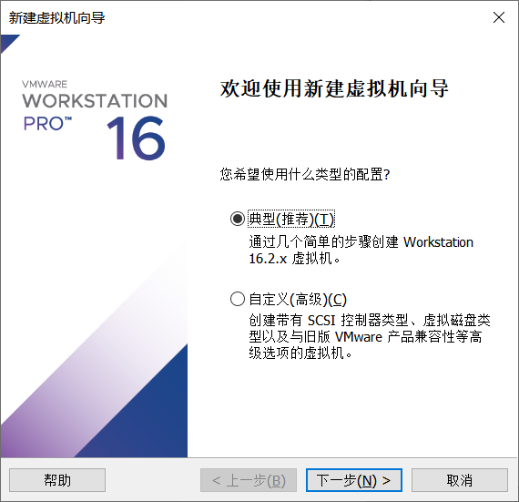
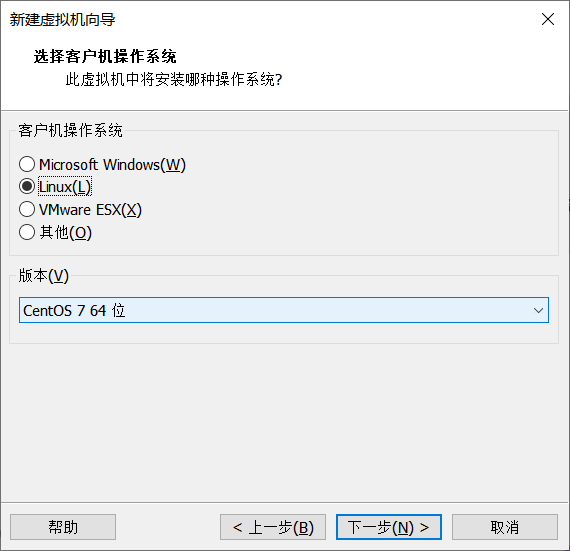

# Linux操作系统

## 第01节 环境准备

### 1. 虚拟机创建

新建虚拟机

选择典型安装

选择稍后安装操作系统

选择系统版本，使用CentOS 7 64位

名称和位置可以自主设置

磁盘大小使用默认值即可

完成

### 2. 虚拟机设置

点击编辑虚拟机设置选项

设置系统镜像，选择软件中提供的CentOS-7-x86_64-DVD-1810.iso镜像，内存及处理器可根据自己电脑情况设置

### 3. 网络设置

将虚拟机网络配置修改为NAT模型

windows系统全局搜索框输入：网络连接，找到VMware Network Adapter VMnet8虚拟网卡

修改VMnet8配置信息，选择IPv4选项，单击属性

修改IP地址、子网掩码及默认网关

修改虚拟网络编辑器

获取设置权限

修改子网

确认网关是否正确

### 4. 系统安装

点击开启虚拟机

选择安装CentOS 7

选择简体中文

修改需要安装的软件

选择基础设施服务器

修改安装位置

配置网络及主机

打开网络连接，并修改主机名

配置固定IP地址，方便后续远程连接

设置root用户密码

如果密码比较简单，需要点击两次完成

等待安装完毕后，点击重启按钮

以root用户身份登录: 输入 root  , 然后输入密码 即可登录成功

### 5. 远程连接工具

打开xshell远程连接工具，点击新建连接

填写虚拟机IP地址

点击用户验证选项，输入虚拟机的账号密码

点击连接

点击接收并保存

## 第02节 Linux文件系统

### 1. 基本概念

操作系统中负责管理和存储文件信息的软件机构称为文件管理系统，简称文件系统；

几乎主流的文件系统都是从/根目录开始的，Linux也不例外，而windows文件系统会以盘符来区分不同文件系统；

目录树中节点分为两个种类：目录（directory）、文件（file）;

从根目录开始，路径具有唯一性； 

- 文件系统的结构通常叫做目录树结构，从斜杠/根目录开始；
- Linux号称“万物皆文件”，意味着针对Linux的操作，大多数时间是在针对Linux文件系统操作

### 2. 常见目录介绍

- /bin： bin目录下都是二进制可执行文件，bin目录放置的是最基本的一些命令的可执行文件，比如cp、mv、mkdir、chmod、chown等等
- /sbin：此目录存放系统管理员使用的命令。
- /home：存放普通用户的主目录，在Linux中每个用户都有一个自己的目录，一般以用户账号命名。
- /root：该目录为系统管理员，也称为超级权限者的用户主目录
- /lib：系统启动时所需的最基本的动态连接共享库，其作用类似于Windows里的DLL文件，几乎所有程序都需要用到这些共享库。
- /etc：所有的系统管理所需要的配置文件和子目录
- /usr：这是一个非常重要的目录，用户的很多程序和文件都放在这个目录，类似于Windows的program files目录
- /tmp：此目录用于存放临时文件
- /opt: 此目录用于存放额外安装的软件，比如需要安装MySQL数据库，则可以放到此目录。
- /var: 用于存放不断扩充的内容，习惯将经常被修改的文件放入此目录，比如日志文件。

### 3. 路径与特殊符号

- 当前路径：也叫当前工作目录，当下用户所属的位置；
- 相对路径：相对当前工作目录开始的路径，会随当前路径变化而变化；
- 绝对路径：不管工作目录在哪，绝对路径都是从/根目录开始，唯一不重复

- . 目录或者文件名字以.开始表示是隐藏的文件，如果路径以.开始表示当前路径
- .. 当前目录的上一级目录
- ~ 当前用户的home目录，比如root用户home目录是/root
- / 根目录

## 第03节 Linux常用命令

### 1. 常用快捷键

| 常用快捷键 | 功能                         |
| ---------- | ---------------------------- |
| ctrl + c   | 停止进程                     |
| ctrl+l     | 清屏；彻底清屏是：reset      |
| ctrl + q   | 退出                         |
| tab键      | 提示(更重要的是可以防止敲错) |
| 上下键     | 查找执行过的命令             |

### 2. 文件目录类

#### pwd

pwd：print working directory，显示当前工作目录的绝对路径

~~~shell
[root@server ~]# pwd
/root
~~~

#### ls

ls :list，列出目录的内容

~~~
ls [选项] [目录或是文件]
~~~

| 选项 | 功能                                                  |
| ---- | ----------------------------------------------------- |
| -a   | 全部的文件，连同隐藏文件( 开头为 . 的文件) 一起列出来 |
| -l   | 长数据串列出，包含文件的属性与权限等等数据；          |

每行列出的信息依次是： 文件类型与权限 链接数 文件属主 文件属组 文件大小用byte来表示 建立或最近修改的时间 名字 

~~~shell
[root@server ~]# ls -al
总用量 28
dr-xr-x---.  4 root root  164 6月   7 15:25 .
dr-xr-xr-x. 17 root root  224 6月   7 15:13 ..
-rw-------.  1 root root 1353 6月   7 15:13 anaconda-ks.cfg
-rw-------.  1 root root   57 6月   7 15:31 .bash_history
-rw-r--r--.  1 root root   18 12月 29 2013 .bash_logout
-rw-r--r--.  1 root root  176 12月 29 2013 .bash_profile
-rw-r--r--.  1 root root  176 12月 29 2013 .bashrc
drwxr-xr-x.  3 root root   18 6月   7 15:15 .cache
drwxr-xr-x.  3 root root   18 6月   7 15:15 .config
-rw-r--r--.  1 root root  100 12月 29 2013 .cshrc
-rw-r--r--.  1 root root  129 12月 29 2013 .tcshrc
~~~

#### cd

cd: Change Directory，切换目录

| 参数        | 功能                     |
| ----------- | ------------------------ |
| cd 绝对路径 | 切换路径                 |
| cd 相对路径 | 切换路径                 |
| cd ~或者cd  | 回到自己的家目录         |
| cd -        | 回到上一次所在目录       |
| cd ..       | 回到当前目录的上一级目录 |

#### mkdir

mkdir：Make directory ，创建一个新的目录

~~~shell
[root@server ~]# mkdir test
[root@server ~]# ls
anaconda-ks.cfg  test 
~~~

递归创建

~~~shell
[root@server ~]# mkdir -p a/b/c
[root@server ~]# ls -R a
a:
b

a/b:
c

a/b/c:
~~~

#### rmdir

rmdir: Remove directory， 删除一个空的目录

~~~shell
[root@server ~]# rmdir a
rmdir: 删除 "a" 失败: 目录非空
[root@server ~]# rmdir test
[root@server ~]# ls
a  anaconda-ks.cfg
~~~

#### touch

touch 创建空文件

~~~shell
[root@server ~]# touch b.txt
[root@server ~]# ls
a  anaconda-ks.cfg  b.txt
~~~

#### cp

cp 复制文件或目录

~~~
cp [选项] source dest
~~~

| 选项   | 功能                                     |
| ------ | ---------------------------------------- |
| -r     | 递归复制整个文件夹，复制目录时使用-r选项 |
| source | 源文件                                   |
| dest   | 目标文件                                 |

~~~shell
[root@server ~]# cp b.txt b.txt.bak
[root@server ~]# ls
a  anaconda-ks.cfg  b.txt  b.txt.bak
~~~

#### rm

rm 移除文件或目录

~~~
rm [选项] deleteFile
~~~

| 选项 | 功能                                     |
| ---- | ---------------------------------------- |
| -r   | 递归删除目录中所有内容                   |
| -f   | 强制执行删除操作，而不提示用于进行确认。 |
| -v   | 显示指令的详细执行过程                   |

~~~shell
[root@server ~]# rm b.txt
rm：是否删除普通空文件 "b.txt"？y
~~~

删除目录，并忽略提示

~~~shell
[root@server ~]# rm -rf a
~~~

#### mv

mv 移动文件与目录或重命名

- mv oldNameFile newNameFile	（功能描述：重命名）

- mv /temp/movefile /targetFolder	（功能描述：移动文件）

重命名文件

~~~shell
[root@server ~]# mv b.txt.bak b.txt
~~~

移动文件

~~~sh
[root@server ~]# mv b.txt /tmp/
~~~

#### cat

cat 查看文件内容

~~~
cat  [选项] 要查看的文件
~~~

| 选项 | 功能描述                     |
| ---- | ---------------------------- |
| -n   | 显示所有行的行号，包括空行。 |

~~~sh
[root@server ~]# cat -n b.txt 
     1	hello
     2	world
~~~

#### more

more 文件内容分屏查看器

more指令是一个基于VI编辑器的文本过滤器，它以全屏幕的方式按页显示文本文件的内容。more指令中内置了若干快捷键，详见操作说明。

~~~
more 要查看的文件
~~~

| 操作           | 功能说明                                 |
| -------------- | ---------------------------------------- |
| 空白键 (space) | 代表向下翻一页；                         |
| Enter          | 代表向下翻『一行』；                     |
| q              | 代表立刻离开 more ，不再显示该文件内容。 |
| Ctrl+F         | 向下滚动一屏                             |
| Ctrl+B         | 返回上一屏                               |
| =              | 输出当前行的行号                         |
| :f             | 输出文件名和当前行的行号                 |

~~~sh
[root@server ~]# more anaconda-ks.cfg
~~~

#### less

less 分屏显示文件内容

less指令用来分屏查看文件内容，它的功能与more指令类似，但是比more指令更加强大，支持各种显示终端。less指令在显示文件内容时，并不是一次将整个文件加载之后才显示，而是根据显示需要加载内容，对于显示大型文件具有较高的效率。

~~~sh
less 要查看的文件
~~~

| 操作       | 功能说明                                           |
| ---------- | -------------------------------------------------- |
| 空白键     | 向下翻动一页；                                     |
| [pagedown] | 向下翻动一页                                       |
| [pageup]   | 向上翻动一页；                                     |
| /字串      | 向下搜寻『字串』的功能；n：向下查找；N：向上查找； |
| ?字串      | 向上搜寻『字串』的功能；n：向上查找；N：向下查找； |
| q          | 离开 less 这个程序；                               |

~~~sh
[root@server ~]# less anaconda-ks.cfg
~~~

#### echo 

echo 输出内容到控制台

~~~shell
[root@server ~]# echo "hello\tworld"
hello\tworld
~~~

~~~shell
[root@server ~]# echo -e "hello\tworld"
hello	world
~~~

#### head

head 显示文件头部内容，默认情况下head指令显示文件的前10行内容

~~~
head 文件	      （功能描述：查看文件头10行内容）
head -n 5 文件      （功能描述：查看文件头5行内容，5可以是任意行数）
~~~

~~~sh
[root@server ~]# head -n 5  anaconda-ks.cfg
~~~

#### tail

tail 输出文件尾部内容，默认情况下tail指令显示文件的后10行内容。

~~~
tail  文件 			（功能描述：查看文件头10行内容）
tail  -n 5 文件 		（功能描述：查看文件头5行内容，5可以是任意行数）
tail  -f  文件		（功能描述：实时追踪该文档的所有更新，监视文件变化）
~~~

~~~sh
[root@server ~]# tail -n 5 anaconda-ks.cfg
[root@server ~]# tail -f b.txt
~~~

#### 重定向

\> 输出重定向和 >> 追加

~~~
ls -l >文件		（功能描述：列表的内容写入文件a.txt中（覆盖写））
ls -al >>文件		（功能描述：列表的内容追加到文件aa.txt的末尾）
cat 文件1 > 文件2	（功能描述：将文件1的内容覆盖到文件2）
echo “内容” >> 文件
~~~

~~~sh
[root@server ~]# ls > b.txt 
[root@server ~]# ls >> b.txt
[root@server ~]# echo hello > b.txt 
[root@server ~]# cat b.txt 
hello
~~~

#### ln

ln 软链接

软链接也成为符号链接，类似于windows里的快捷方式，有自己的数据块，主要存放了链接其他文件的路径。

~~~
ln -s [原文件或目录] [软链接名]		（功能描述：给原文件创建一个软链接）
~~~

创建软链接

~~~sh
[root@server ~]# mv b.txt test/
[root@server ~]# ln -s test/b.txt blink
[root@server ~]# ll
lrwxrwxrwx. 1 root root   10 6月   8 10:58 blink -> test/b.txt
~~~

删除软连接

~~~sh
[root@server ~]# rm -rf blink
~~~

history 查看已经执行过历史命令

~~~sh
[root@server ~]# history
~~~

### 3.  用户管理命令

#### useradd

useradd 添加新用户

~~~
useradd 用户名			（功能描述：添加新用户）
useradd -g 组名 用户名	（功能描述：添加新用户到某个组）
~~~

~~~shell
[root@server ~]# useradd zhangsan
[root@server ~]# ll /home/
总用量 0
drwx------. 2 zhangsan zhangsan 62 6月   8 11:11 zhangsan
~~~

passwd 设置用户密码

~~~
passwd 用户名	（功能描述：设置用户密码）
~~~

~~~sh
[root@server ~]# passwd zhangsan
~~~

id 查看用户是否存在

~~~shell
[root@server ~]# id zhangsan
uid=1000(zhangsan) gid=1000(zhangsan) 组=1000(zhangsan)
[root@server ~]# 
~~~

cat  /etc/passwd 查看创建了哪些用户

~~~sh
[root@server ~]# cat /etc/passwd
~~~

su : swith user，切换用户

~~~sh
su 用户名称   （功能描述：切换用户，只能获得用户的执行权限，不能获得环境变量）
su - 用户名称		（功能描述：切换到用户并获得该用户的环境变量及执行权限）
~~~

~~~sh
[root@server ~]# su zhangsan
[zhangsan@server root]$ echo $PATH
/usr/local/sbin:/usr/local/bin:/usr/sbin:/usr/bin:/root/bin
~~~

~~~sh
[zhangsan@server root]$ su - zhangsan
密码：
[zhangsan@server ~]$ echo $PATH
/usr/local/bin:/bin:/usr/bin:/usr/local/sbin:/usr/sbin:/home/zhangsan/.local/bin:/home/zhangsan/bin
~~~

#### userdel

userdel 删除用户

~~~
userdel  用户名		（功能描述：删除用户但保存用户主目录）
userdel -r 用户名		（功能描述：用户和用户主目录，都删除）
~~~

#### sudo

sudo 设置普通用户具有root权限

使用用普通用户在/opt目录下创建一个文件夹

~~~sh
[zhangsan@server ~]$ mkdir /opt/demo
mkdir: 无法创建目录"/opt/demo": 权限不够
~~~

修改/etc/sudoers 文件，在%wheel 这行下面添加一行，注意修改sudoers 文件不能直接使用vim命令，应该使用visudo命令

如下所示：

~~~sh
[root@server ~]# visudo
## Allows people in group wheel to run all commands
%wheel ALL=(ALL) ALL
zhangsan   ALL=(ALL)     ALL
~~~

或者配置成采用sudo命令时，不需要输入密码

~~~
## Allows people in group wheel to run all commands
%wheel ALL=(ALL) ALL
atguigu   ALL=(ALL)     NOPASSWD:ALL
~~~

修改完毕，现在可以用zhangsan帐号登录，然后用命令 sudo ，即可获得root权限进行操作。

~~~sh
[zhangsan@server ~]$ sudo mkdir /opt/demo
~~~

#### usermod

usermod 修改用户

~~~
usermod -g 用户组 用户名
~~~

| 选项 | 功能                                                  |
| ---- | ----------------------------------------------------- |
| -g   | 修改用户的初始登录组，给定的组必须存在。默认组id是1。 |

将用户加入到用户组

~~~sh
[root@server ~]# usermod -g root zhangsan
~~~

#### 用户组管理命令

每个用户都有一个用户组，系统可以对一个用户组中的所有用户进行集中管理,用户属于与它同名的用户组，这个用户组在创建用户时同时创建。

用户组的管理涉及用户组的添加、删除和修改。组的增加、删除和修改实际上就是对/etc/group文件的更新。

groupadd 新增组

~~~
groupadd 组名
~~~

~~~sh
[root@server ~]# groupadd test
~~~

groupdel 删除组

~~~sh
groupdel 组名
~~~

~~~sh
[root@server ~]# groupdel test
~~~

cat  /etc/group 查看创建了哪些组

~~~sh
[root@server ~]# cat /etc/group
~~~

### 4. 文件权限类

Linux系统是一种典型的多用户系统，不同的用户处于不同的地位，拥有不同的权限。为了保护系统的安全性，Linux系统对不同的用户访问同一文件（包括目录文件）的权限做了不同的规定。

在Linux中我们可以使用ll或者ls -l命令来显示一个文件的属性以及文件所属的用户和组。

ls命令列出的第一个字段（共十位字符）中包含了文件类型和文件权限.

Linux系统将一个文件的可设置权限的用户分成三类：

- 所有者（User）
- 同组用户（Group）
- 其他用户（Other）

第2-10 位字符用来表示权限,这9个字符被分为三组，每组3个各字符对应以上三种用户的访问权限控制.

#### 修改文件权限

- Linux系统提供了chmod和chown命令，分别用来修改文件/目录的权限和属主.

- chmod命令可用来更改目录或文件的权限，其命令格式如下：

~~~
chmod [-R] [权限值] [目录|文件]
~~~

- 只有文件所有者和超级用户可以修改文件或目录的权限。

- [-R]表示递归修改子目录权限

- chmod允许使用以下两种方式来指定权限值：
  - 使用权限符号
  - 使用八进制数字

~~~sh
$ chmod o-r dante
$ chmod g-r dante
$ chmod u+x,go+r dante
$ chmod a=rw dante
~~~

其中：

- u 表示该文件的拥有者，g 表示与该文件的拥有者属于同一个群体(group)者，o 表示其他以外的人，a 表示这三者皆是。
- \+ 表示增加权限、- 表示取消权限、= 表示唯一设定权限。
- r 表示可读取，w 表示可写入，x 表示可执行，X 表示只有当该文件是个子目录或者该文件已经被设定过为可执行。

除了使用权限符号，还可使用三位八进制数字来表示权限：

- 第一位对应所有者权限
- 第二位对应所有组权限
- 第三位对应其他用户权限

将上述各八进制数字转换为三位的二进制数

- 分别对应读、写和执行权限
- 值0表示禁止，值1则表示允许

- 例如：

~~~sh
$ chmod 555 dante
$ chmod 775 dante
$ chmod 755 dante
~~~

#### 修改文件属主

- 文件的所有者缺省为文件创建者，但可以通过命令来改变它.
- chown命令可用来更改目录或文件所有者及所属组，其命令格式如下：

~~~shell
chown [-R] 用户:组 [目录|文件]
~~~

- 该命令只有root用户能够执行
- [-R]表示递归修改子目录属主

~~~sh
$ chown gaoke file
~~~

### 5. 搜索查找类

#### find

find 查找文件或者目录，find指令将从指定目录向下递归地遍历其各个子目录，将满足条件的文件显示在终端。

~~~
find [搜索范围] [选项]
~~~

| 选项            | 功能                             |
| --------------- | -------------------------------- |
| -name<查询方式> | 按照指定的文件名查找模式查找文件 |
| -size<文件大小> | 按照指定的文件大小查找文件。     |

按文件名：根据名称查找/目录下的filename.txt文件。

~~~sh
[root@server ~]# find /root -name *.txt
~~~

按文件大小：在/home目录下查找大于200m的文件（+n 大于  -n小于  n等于）

~~~sh
[root@server ~]find /home -size +204800
~~~

#### locate

locate快速定位文件路径

locate指令利用事先建立的系统中所有文件名称及路径的locate数据库实现快速定位给定的文件。Locate指令无需遍历整个文件系统，查询速度较快。为了保证查询结果的准确度，管理员必须定期更新locate时刻。

由于locate指令基于数据库进行查询，所以第一次运行前，必须使用updatedb指令创建locate数据库。

~~~sh
[root@server ~]# updatedb
[root@server ~]# locate tmp
~~~

#### grep

grep 过滤查找及“|”管道符

管道符，“|”，表示将前一个命令的处理结果输出传递给后面的命令处理

~~~
grep 选项 查找内容 源文件
~~~

| 选项 | 功能               |
| ---- | ------------------ |
| -n   | 显示匹配行及行号。 |

~~~sh
[root@server ~]# ls | grep -n test
~~~

### 6. 压缩和解压类

#### gzip/gunzip

gzip/gunzip 压缩，只能压缩文件不能压缩目录，不保留原来的文件

~~~
gzip 文件		（功能描述：压缩文件，只能将文件压缩为*.gz文件）
gunzip 文件.gz	（功能描述：解压缩文件命令）
~~~

~~~sh
[root@server ~]# gzip demo.txt
[root@server ~]# ls
demo.txt.gz
~~~

#### tar 打包

~~~
tar  [选项]  XXX.tar  将要打包进去的内容		（功能描述：打包目录，文件格式.tar）
~~~

| 选项 | 功能             |
| ---- | ---------------- |
| -c   | 产生.tar打包文件 |
| -v   | 显示详细信息     |
| -f   | 指打包后的文件名 |
| -z   | 打包同时压缩     |
| -x   | 解包.tar文件     |

压缩多个文件

~~~sh
[root@server opt]# tar -zcvf test.tar.gz a.txt b.txt 
a.txt
b.txt
[root@server opt]# ls
test.tar.gz a.txt b.txt
~~~

压缩目录

~~~sh
[root@server ~]# tar -zcvf test.tar.gz test/
test/
test/b.txt
~~~

解压到当前目录

~~~sh
[root@server ~]# tar -zxvf test.tar.gz
~~~

解压到指定目录

~~~sh
[root@server ~]# tar -zxvf test.tar.gz -C /opt
~~~

### 7. 进程线程类

进程是正在执行的一个程序或命令，每一个进程都是一个运行的实体，都有自己的地址空间，并占用一定的系统资源。

#### ps

ps 查看当前系统进程状态

~~~
ps aux | grep xxx		（功能描述：查看系统中所有进程）
ps -ef | grep xxx		（功能描述：可以查看子父进程之间的关系）
~~~

| 选项 | 功能                   |
| ---- | ---------------------- |
| -a   | 选择所有进程           |
| -u   | 显示所有用户的所有进程 |
| -x   | 显示没有终端的进程     |

~~~sh
[root@server ~]# ps aux
USER        PID %CPU %MEM    VSZ   RSS TTY      STAT START   TIME COMMAND
root          1  0.0  0.3 128096  6620 ?        Ss   10:07   0:01 /usr/lib/systemd/systemd --s
root          2  0.0  0.0      0     0 ?        S    10:07   0:00 [kthreadd]
root          3  0.0  0.0      0     0 ?        S    10:07   0:00 [ksoftirqd/0]
root          5  0.0  0.0      0     0 ?        S<   10:07   0:00 [kworker/0:0H]
~~~

ps aux显示信息说明

USER：该进程是由哪个用户产生的

PID：进程的ID号

%CPU：该进程占用CPU资源的百分比，占用越高，进程越耗费资源；

%MEM：该进程占用物理内存的百分比，占用越高，进程越耗费资源；

VSZ：该进程占用虚拟内存的大小，单位KB；

RSS：该进程占用实际物理内存的大小，单位KB；

TTY：该进程是在哪个终端中运行的。其中tty1-tty7代表本地控制台终端，tty1-tty6是本地的字符界面终端，tty7是图形终端。pts/0-255代表虚拟终端。

STAT：进程状态。常见的状态有：R：运行、S：睡眠、T：停止状态、s：包含子进程、+：位于后台

START：该进程的启动时间

TIME：该进程占用CPU的运算时间，注意不是系统时间

COMMAND：产生此进程的命令名

~~~sh
[root@server ~]# ps -ef
UID         PID   PPID  C STIME TTY          TIME CMD
root          1      0  0 10:07 ?        00:00:01 /usr/lib/systemd/systemd --switched-root --s
root          2      0  0 10:07 ?        00:00:00 [kthreadd]
root          3      2  0 10:07 ?        00:00:00 [ksoftirqd/0]
root          5      2  0 10:07 ?        00:00:00 [kworker/0:0H]
root          7      2  0 10:07 ?        00:00:00 [migration/0]
root          8      2  0 10:07 ?        00:00:00 [rcu_bh]
~~~

ps -ef显示信息说明

UID：用户ID 

PID：进程ID 

PPID：父进程ID 

C：CPU用于计算执行优先级的因子。数值越大，表明进程是CPU密集型运算，执行优先级会降低；数值越小，表明进程是I/O密集型运算，执行优先级会提高 

STIME：进程启动的时间 

TTY：完整的终端名称 

TIME：CPU时间 

CMD：启动进程所用的命令和参数

如果想查看进程的CPU占用率和内存占用率，可以使用aux;

如果想查看进程的父进程ID可以使用ef;

#### kill 终止进程

~~~
kill  [选项] 进程号		（功能描述：通过进程号杀死进程）
killall 进程名称			（功能描述：通过进程名称杀死进程，也支持通配符，这在系统因负载过大而变得很慢时很有用）	
~~~

| 选项 | 功能                 |
| ---- | -------------------- |
| -9   | 表示强迫进程立即停止 |

杀死浏览器进程

~~~sh
kill -9 5102
~~~

通过进程名称杀死进程

~~~sh
killall firefox
~~~

#### netstat

netstat 显示网络统计信息和端口占用情况

~~~
netstat -anp |grep 进程号	（功能描述：查看该进程网络信息）
netstat -nlp |grep 端口号	（功能描述：查看网络端口号占用情况）
~~~

| 选项 | 功能                                     |
| ---- | ---------------------------------------- |
| -n   | 拒绝显示别名，能显示数字的全部转化成数字 |
| -l   | 仅列出有在listen（监听）的服务状态       |
| -p   | 表示显示哪个进程在调用                   |

通过进程号查看该进程的网络信息

~~~sh
netstat -anp | grep 火狐浏览器进程号
~~~

查看某端口号是否被占用

~~~sh
netstat -nlp | grep 20670
~~~

### 8. crontab 定时任务设置

~~~
crontab [选项]
~~~

| 选项 | 功能                          |
| ---- | ----------------------------- |
| -e   | 编辑crontab定时任务           |
| -l   | 查询crontab任务               |
| -r   | 删除当前用户所有的crontab任务 |

~~~sh
crontab -e
~~~

进入crontab编辑界面，会打开vim编辑器。

\* * * * * 执行的任务

| 项目     | 含义         | 范围             |
| ------ | ---------- | -------------- |
| 第一个“*” | 一小时当中的第几分钟 | 0-59           |
| 第二个“*” | 一天当中的第几小时  | 0-23           |
| 第三个“*” | 一个月当中的第几天  | 1-31           |
| 第四个“*” | 一年当中的第几月   | 1-12           |
| 第五个“*” | 一周当中的星期几   | 0-7（0和7都代表星期日） |

特殊符号

| 特殊符号 | 含义                                                             |
| ---- | -------------------------------------------------------------- |
| *    | 代表任何时间。比如第一个“*”就代表一小时中每分钟都执行一次的意思。                             |
| ，    | 代表不连续的时间。比如“0 8,12,16 * * * 命令”，就代表在每天的8点0分，12点0分，16点0分都执行一次命令 |
| -    | 代表连续的时间范围。比如“0 5  *  *  1-6命令”，代表在周一到周六的凌晨5点0分执行命令             |
| */n  | 代表每隔多久执行一次。比如“*/10  *  *  *  *  命令”，代表每隔10分钟就执行一遍命令            |

特定时间执行命令

| 时间              | 含义                                                               |
| --------------- | ---------------------------------------------------------------- |
| 45 22 * * * 命令  | 在22点45分执行命令                                                      |
| 0 17 * * 1 命令   | 每周1 的17点0分执行命令                                                   |
| 0 5 1,15 * * 命令 | 每月1号和15号的凌晨5点0分执行命令                                              |
| 40 4 * * 1-5 命令 | 每周一到周五的凌晨4点40分执行命令                                               |
| */10 4 * * * 命令 | 每天的凌晨4点，每隔10分钟执行一次命令                                             |
| 0 0 1,15 * 1 命令 | 每月1号和15号，每周1的0点0分都会执行命令。注意：星期几和几号最好不要同时出现，因为他们定义的都是天。非常容易让管理员混乱。 |

每隔1分钟，向/root/bailongma.txt文件中添加一个11的数字

~~~
*/1 * * * * /bin/echo ”11” >> /root/bailongma.txt
~~~

## 第04节 软件包管理

### 1. RPM

RPM（RedHat Package Manager），RedHat软件包管理工具， 是Linux这系列操作系统里面的打包安装工具。

RPM查询命令

~~~sh
rpm -qa				（功能描述：查询所安装的所有rpm软件包）
由于软件包比较多，一般都会采取过滤。
rpm -qa | grep rpm软件包
~~~

查询mariadb软件安装情况

~~~sh
rpm -qa|grep mariadb
~~~

RPM卸载命令（rpm -e）

~~~
rpm -e RPM软件包   
rpm -e --nodeps 软件包
~~~

| 选项       | 功能                                          |
| -------- | ------------------------------------------- |
| -e       | 卸载软件包                                       |
| --nodeps | 卸载软件时，不检查依赖。这样的话，那些使用该软件包的软件在此之后可能就不能正常工作了。 |

卸载firefox软件

~~~sh
rpm -e firefox
~~~

RPM安装命令（rpm -ivh）

~~~
rpm -ivh RPM包全名
~~~

| 选项     | 功能                     |
| -------- | ------------------------ |
| -i       | -i=install，安装         |
| -v       | -v=verbose，显示详细信息 |
| -h       | -h=hash，进度条          |
| --nodeps | --nodeps，不检测依赖进度 |

安装firefox软件

~~~sh
rpm -ivh firefox-45.0.1-1.el6.centos.x86_64.rpm 
~~~

### 2. YUM

YUM（全称为 Yellow dog Updater, Modified）是一个在Fedora和RedHat以及CentOS中的Shell前端软件包管理器。基于RPM包管理，能够从指定的服务器自动下载RPM包并且安装，可以自动处理依赖性关系，并且一次安装所有依赖的软件包，无须繁琐地一次次下载、安装。

~~~
yum [选项] [参数]
~~~

| 选项 | 功能                  |
| ---- | --------------------- |
| -y   | 对所有提问都回答“yes” |

| 参数         | 功能                          |
| ------------ | ----------------------------- |
| install      | 安装rpm软件包                 |
| update       | 更新rpm软件包                 |
| check-update | 检查是否有可用的更新rpm软件包 |
| remove       | 删除指定的rpm软件包           |
| list         | 显示软件包信息                |
| clean        | 清理yum过期的缓存             |
| deplist      | 显示yum软件包的所有依赖关系   |

采用yum方式安装firefox

~~~sh
yum -y install firefox.x86_64
~~~

### 3. JDK安装

创建server目录，用于存放文件

~~~sh
mkdir /opt/server
~~~

安装lrzsz工具用于上传下载文件（非必须，可以使用xftp上传文件）

~~~sh
yum install lrzsz -y
~~~

上传JDK安装包

~~~sh
cd /opt/server
rz -E
~~~

解压JDK安装包

~~~sh
tar -zvxf jdk-8u131-linux-x64.tar.gz
~~~

配置环境变量，编辑 /etc/profile 文件， vim命令输入i进入插入模式可以编辑内容，通过esc退出插入模式，输入:wq保存退出文本

~~~sh
vim /etc/profile
# 文件末尾增加
export JAVA_HOME=/opt/server/jdk1.8.0_131
export PATH=${JAVA_HOME}/bin:$PATH
~~~

执行source命令，使环境变量生效

~~~sh
source /etc/profile
~~~

检查是否安装成功

~~~sh
java -version
~~~

### 4. MySQL安装

卸载Centos7自带mariadb

~~~sh
# 查找
rpm -qa|grep mariadb
# mariadb-libs-5.5.60-1.el7_5.x86_64
# 卸载
rpm -e mariadb-libs-5.5.60-1.el7_5.x86_64 --nodeps
~~~

创建mysql安装包存放点

~~~sh
mkdir /opt/server/mysql
~~~

解压

~~~sh
tar -xvf mysql-5.7.34-1.el7.x86_64.rpm-bundle.tar -C /opt/server/mysql/
~~~

执行安装

~~~sh
# 安装依赖
yum -y install libaio
yum -y install libncurses*
yum -y install perl perl-devel
# 切换到安装目录
cd /opt/server/mysql/
# 安装
rpm -ivh mysql-community-common-5.7.34-1.el7.x86_64.rpm 
rpm -ivh mysql-community-libs-5.7.34-1.el7.x86_64.rpm 
rpm -ivh mysql-community-devel-5.7.34-1.el7.x86_64.rpm
rpm -ivh mysql-community-client-5.7.34-1.el7.x86_64.rpm 
rpm -ivh mysql-community-server-5.7.34-1.el7.x86_64.rpm
~~~

启动Mysql

~~~sh
#启动mysql
systemctl start mysqld.service
#查看生成的临时root密码
cat  /var/log/mysqld.log | grep password
~~~

修改初始的随机密码

~~~sh
# 登录mysql
mysql -u root -p
Enter password:     #输入在日志中生成的临时密码
# 更新root密码  设置为root
set global validate_password_policy=0;
set global validate_password_length=1;
set password=password('root');
~~~

授予远程连接权限

~~~sh
grant all privileges on *.* to 'root' @'%' identified by 'root';
# 刷新
flush privileges;
~~~

控制命令

~~~sh
#mysql的启动和关闭 状态查看
systemctl stop mysqld
systemctl status mysqld
systemctl start mysqld

#建议设置为开机自启动服务
systemctl enable  mysqld
#查看是否已经设置自启动成功
systemctl list-unit-files | grep mysqld
~~~

防火墙

~~~sh
# 查看防火墙状态
systemctl status firewalld
# 关闭防火墙
systemctl stop firewalld
# 设置防火墙开机不自动启动
systemctl disable firewalld
~~~

## 第05节 VI/VIM编辑器

VI是Unix操作系统和类Unix操作系统中最通用的文本编辑器。

VIM编辑器是从VI发展出来的一个性能更强大的文本编辑器。可以主动的以字体颜色辨别语法的正确性，方便程序设计。VIM与VI编辑器完全兼容。

### 1. 一般模式

以vi打开一个档案就直接进入一般模式了（这是默认的模式）。在这个模式中， 可以使用『上下左右』按键来移动光标，具体操作如下：

| 语法          | 功能描述                |
| ----------- | ------------------- |
| yy          | 复制光标当前一行            |
| y数字y        | 复制一段（从第几行到第几行）      |
| p           | 箭头移动到目的行粘贴          |
| u           | 撤销上一步               |
| dd          | 删除光标当前行             |
| d数字d        | 删除光标（含）后多少行         |
| x           | 删除一个字母，相当于del       |
| X           | 删除一个字母，相当于Backspace |
| yw          | 复制一个词               |
| dw          | 删除一个词               |
| shift+^     | 移动到行头               |
| shift+$     | 移动到行尾               |
| 1+shift+g   | 移动到页头，数字            |
| shift+g     | 移动到页尾               |
| 数字N+shift+g | 移动到目标行              |

### 2. 编辑模式

在一般模式中可以进行删除、复制、粘贴等的动作，但是却无法编辑文件内容的！要等到你按下『i, I, o, O, a, A, r, R』等任何一个字母之后才会进入编辑模式。

注意了！通常在Linux中，按下这些按键时，在画面的左下方会出现『INSERT或 REPLACE』的字样，此时才可以进行编辑。而如果要回到一般模式时， 则必须要按下『Esc』这个按键即可退出编辑模式。

进入编辑模式

| 按键 | 功能               |
| ---- | ------------------ |
| i    | 当前光标前         |
| a    | 当前光标后         |
| o    | 当前光标行的下一行 |
| I    | 光标所在行最前     |
| A    | 光标所在行最后     |
| O    | 当前光标行的上一行 |

按『Esc』键，退出编辑模式

### 3. 指令模式

在一般模式当中，输入『 : / ?』3个中的任何一个按钮，就可以将光标移动到最底下那一行。

在这个模式当中， 可以提供你『搜寻资料』的动作，而读取、存盘、大量取代字符、离开 vi 、显示行号等动作是在此模式中达成的！

| 命令         | 功能                             |
| ------------ | -------------------------------- |
| :w           | 保存                             |
| :q           | 退出                             |
| :!           | 强制执行                         |
| /要查找的词  | n 查找下一个，N 往上查找         |
| ? 要查找的词 | n是查找上一个，shift+n是往下查找 |
| :set nu      | 显示行号                         |
| :set nonu    | 关闭行号                         |

强制保存退出，:wq!

### 4. 模式间转换

