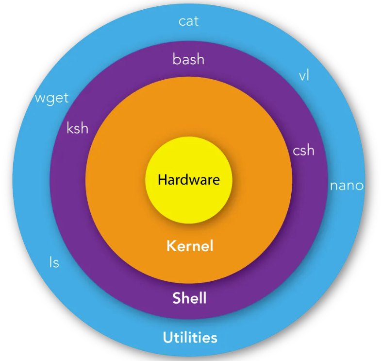

## 第1节. Shell概述

### 1.Shell编程的重要性

Shell脚本语言是实现Linux/UNIX系统管理及自动化运维所必备的重要工具，Linux/UNIX系统的底层及基础应用软件的核心大都涉及Shell脚本的内容。

每一个合格的Linux系统管理员或运维工程师，能够熟练地编写Shell脚本语言，并能够阅读系统及各类软件附带的Shell脚本内容。

### 2.什么是Shell

Shell是一个命令解释器，它的作用是解释执行用户输入的命令及程序等，用户每输入一条命令，Shell就解释执行一条。这种从键盘一输入命令，就可以立即得到回应的对话方式，称为交互的方式。

Shell存在于操作系统的最外层，负责与用户直接对话，把用户的输入解释给操作系统，并处理各种各样的操作系统的输出结果，然后输出到屏幕返回给用户。输入系统用户名和密码并登录到Linux后的所有操作都是由Shell解释与执行的。

Shell的英文是贝壳的意思，从图可以看出，命令解释器（Shell）就像贝壳一样包住了系统核心。

### 3.Shell脚本

当命令或程序语句不在命令行下执行，而是通过一个程序文件来执行时，该程序就被称为Shell脚本。

如果在Shell脚本里内置了很多条命令、语句及循环控制，然后将这些命令一次性执行完毕，这种通过文件执行脚本的方式称为非交互的方式。

Shell脚本类似于DOS系统下的批处理程序（早期扩展名一般为“*.bat”）。用户可以在Shell脚本中敲入一系列的命令及命令语句组合。这些命令、变量和流程控制语句等有机地结合起来，就形成了一个功能强大的Shell脚本。

### 4. Shell脚本在Linux运维工作中的地位

Shell脚本语言很适合用于处理纯文本类型的数据，而Linux系统中几乎所有的配置文件、日志文件（如NFS、Rsync、Httpd、Nginx、LVS、MySQL等），以及绝大多数的启动文件都是纯文本类型的文件。因此，学好Shell脚本语言，就可以利用它在Linux系统中发挥巨大的作用。

### 5. Shell脚本的种类

Shell脚本语言是弱类型语言（无须定义变量的类型即可使用），在Unix/Linux中主要有两大类Shell：一类是Bourne shell，另一类是C shell。 

#### Bourne shell

Bourne shell又包括Bourne shell（sh）、Korn shell（ksh）、Bourne Again Shell（bash）三种类型。

- Bourne shell（sh）由AT&T的Steve Bourne开发，是标准的UNIX Shell，很多UNIX系统都配有sh。

- Korn shell（ksh）由David Korn开发，是Bourne shell（sh）的超集合，并且添加了csh引入的新功能，是目前很多UNIX系统标准配置的Shell，这些系统上的/bin/sh往往是指向/bin/ksh的符号链接。

- Bourne Again Shell（bash）由GNU项目组开发，主要目标是与POSIX标准保持一致，同时兼顾对sh的兼容，bash从csh和ksh借鉴了很多功能，是各种Linux发行版默认配置的Shell，Linux系统上的/bin/sh往往是指向/bin/bash的符号链接。

#### C shell

C shell又包括csh、tcsh两种类型。

- csh由Berkeley大学开发，随BSD UNIX发布，它的流程控制语句很像C语言，支持很多Bourne shell所不支持的功能，例如：作业控制、别名、系统算术、命令历史、命令行编辑等。
- tcsh是csh的增强版，加入了命令补全等功能，在FreeBSD、Mac OS X等系统上替代了csh。

以上介绍的这些Shell中，较为通用的是标准的Bourne shell（sh）和C shell（csh）。其中Bourne shell（sh）已经被Bourne Again shell（bash）所取代。

可通过以下命令查看CentOS系统的Shell支持情况。

~~~
cat /etc/shells
~~~

Linux系统中的主流Shell是bash, bash是由Bourne Shell（sh）发展而来的，同时bash还包含了csh和ksh的特色。

查看CentOS Linux系统默认的Shell。

~~~shell
echo $SHELL
~~~

~~~shell
grep root /etc/passwd
# 结尾的/bin/bash就是用户登录后的Shell解释器。
~~~

#### Shell脚本语言的优势

Shell脚本语言的优势在于处理偏操作系统底层的业务，例如：Linux系统内部的很多应用（有的是应用的一部分）都是使用Shell脚本语言开发的。

对于一些常见的系统脚本，使用Shell开发会更简单、更快速，例如：让软件一键自动化安装、优化，监控报警脚本，软件启动脚本，日志分析脚本等。

### 6. Shell脚本的建立和执行

在Linux系统中，Shell脚本（bash Shell程序）通常是在编辑器vi/vim中编写的，由Shell命令、程序结构控制语句和注释等内容组成。

#### 脚本开头

一个规范的Shell脚本在第一行会指出由哪个程序（解释器）来执行脚本中的内容，这一行内容在Linux bash的编程一般为：

~~~sh
#!/bin/bash
~~~

在执行bash脚本的时候，内核会根据“#! ”后的解释器来确定该用哪个程序解释这个脚本中的内容。

~~~sheLl
ll /bin/ | grep sh
~~~

sh为bash的软链接，大多数情况下，脚本的开头使用“#!/bin/bash”和“#! /bin/sh”是没有区别的，但更规范的写法是在脚本的开头使用“#! /bin/bash”

CentOS和Red Hat Linux下默认的Shell均为bash。因此，在写Shell脚本的时候，脚本的开头即使不加“#! /bin/bash”，它也会交给bash解释

#### Shell脚本的执行

Shell脚本是从上至下依次执行每一行的命令及语句的，即执行完了一个命令后再执行下一个，如果在Shell脚本中遇到子脚本（即脚本嵌套）时，就会先执行子脚本的内容，完成后再返回父脚本继续执行父脚本内后续的命令及语句。

通常情况下，在执行Shell脚本时，会向系统内核请求启动一个新的进程，以便在该进程中执行脚本的命令及子Shell脚本。

Shell脚本的执行通常可以采用以下几种方式。

- bash script-name或sh script-name：这是当脚本文件本身没有可执行权限（即文件权限属性x位为-号）时常使用的方法，或者脚本文件开头没有指定解释器时需要使用的方法。

  ~~~
  bash script-name
  ~~~

- path/script-name或 ./script-name：指在当前路径下执行脚本（脚本需要有执行权限），需要将脚本文件的权限先改为可执行（即文件权限属性加x位），具体方法为chmod +x script-name。然后通过脚本绝对路径或相对路径就可以直接执行脚本了。

  ~~~
  ./script-name
  ~~~

- source script-name或．script-name：这种方法通常是使用source或“.”（点号）读入或加载指定的Shell脚本文件，然后，依次执行指定的Shell脚本文件san.sh中的所有语句。这些语句将在当前父Shell脚本father.sh进程中运行（其他几种模式都会启动新的进程执行子脚本）

  ~~~
  source script-name
  ~~~

source或“.”命令的功能是：在当前Shell中执行source或“.”加载并执行的相关脚本文件中的命令及语句，而不是产生一个子Shell来执行文件中的命令。注意“.”和后面的脚本名之间要有空格。

因此，使用source或“.”可以将自身脚本中的变量值或函数等的返回值传递到当前父Shell脚本father.sh中使用。这是它和其他几种方法最大的区别。
