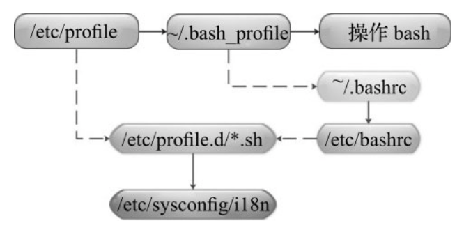

## 第2节 Shell变量

### 1.变量的基本概念

变量用于存储程序中使用的数据，所存储的数据存在于内存空间中，通过变量的名字就可以取出与变量对应的数据，变量定义的语法：

~~~
变量名称=值
~~~

注意”=“的两侧无空格，否则变量名称会被识别为命令，变量的内容一般要加双引号，以防止出错，特别是当值里的内容之间有空格时。

默认情况下，在bash Shell中是不会区分变量类型的，例如：常见的变量类型为整数、字符串、小数等。这和其他强类型语言（例如：Java/C语言）是有区别的。

定义变量，并输入变量的值

~~~shell
a=5
echo $a #通过echo命令加上$即可输出变量的值
~~~

### 2. 子进程Shell与变量的可见性

查看当前和终端相关的进程信息，可以看到只有一个“-bash”进程，此进程也是目前正在使用的bash shell进程

~~~
ps -f
UID         PID   PPID  C STIME TTY          TIME CMD
root       7396   7392  0 12:45 pts/0    00:00:00 -bash
root       7797   7396  0 15:59 pts/0    00:00:00 ps -f
~~~

通过执行 bash命令可以基于当前的shell进程再开启一个新的bash shell进程，既子shell进程

~~~
bash
ps -f
UID         PID   PPID  C STIME TTY          TIME CMD
root       7396   7392  0 12:45 pts/0    00:00:00 -bash
root       7805   7396  0 16:00 pts/0    00:00:00 bash
root       7850   7805  0 16:01 pts/0    00:00:00 ps -f
~~~

可以看到新增的“bash”进程的PPID（父进程ID）为之前的“-bash”进程

通过 exit 命令可以退出子进程

~~~
exit
ps -f
UID         PID   PPID  C STIME TTY          TIME CMD
root       7396   7392  0 12:45 pts/0    00:00:00 -bash
root       7852   7396  0 16:02 pts/0    00:00:00 ps -f
~~~

在当前进程中定义变量，再进入到子shell中，测试是否能够输出变量值

~~~shell
a=100
bash
echo $a #无法输出，说明子Shell中无法获取父Shell中定义的变量
~~~

通过在脚本文件中定义变量，结合脚本文件的三种执行方式进行测试。

### 3. 变量的类型

变量可分为两类：环境变量（全局变量）和普通变量（局部变量）。

环境变量也可称为全局变量，可以在创建它们的Shell及其派生出来的任意子进程Shell中使用，环境变量又可分为自定义环境变量和bash内置的环境变量。

普通变量也可称为局部变量，只能在创建它们的Shell函数或Shell脚本中使用。普通变量一般由开发者在开发脚本程序时创建。

### 4. 环境变量

环境变量一般是指用export内置命令导出的变量，用于定义Shell的运行环境，保证Shell命令的正确执行。

Shell通过环境变量来确定**登录用户名、命令路径、终端类型、登录目录**等，所有的环境变量都是系统全局变量，可用于所有子进程中，这包括编辑器、Shell脚本和各类应用。

#### 系统环境变量

环境变量可以在命令行中设置和创建，但用户退出命令行时这些变量值就会丢失，因此，如果希望永久保存环境变量，可在以下位置配置：

- 用户家目录下的．bash_profile或．bashrc（非用户登录模式特有，例如远程SSH）文件中
- 全局配置/etc/bashrc（非用户登录模式特有，例如远程SSH）或/etc/profile文件中定义。

在将环境变量放入上述的文件中后，每次用户登录时这些变量都将被初始化。

按照系统规范，所有环境变量的名字均采用大写形式。在将环境变量应用于用户进程程序之前，都应该用export命令导出定义，例如：正确的环境变量定义方法为

~~~shell
export FLAG=1
~~~

有一些环境变量，比如HOME、PATH、SHELL、UID、USER等，在用户登录之前就已经被/bin/login程序设置好了。通常环境变量被定义并保存在用户家目录下的．bash_profile文件或全局的配置文件/etc/profile中.

查看环境变量

~~~
env
~~~

显示当前 Shell 中所有变量：

~~~
set
~~~

set命令输出所有的变量，包括全局变量和局部变量；env命令只显示全局变量；

#### 自定义环境变量

如果想要设置环境变量，就要在给变量赋值之后或在设置变量时使用export命令，此处不要在变量名前面加$

~~~
export A=100
~~~

~~~
A=100
export A
~~~

- 对于用户的环境变量设置，比较常见的是用户家目录下的．bashrc和．bash_profile。

- 全局环境变量的配置文件，一般放在/etc/bashrc，/etc/profile中

### 5. 显示与取消环境变量

通过echo打印环境变量，常见系统环境变量：

- $HOME：用户登录时进入的目录。
- $UID：当前用户的UID（用户标识）
- $PWD：当前工作目录的绝对路径名
- $SHELL：当前SHELL。
- USER：当前用户

~~~
echo $HOME
~~~

用unset消除本地变量和环境变量

~~~SHELL
echo $USER
unset USER #可以看到变量的内容显示为空。
~~~

### 6. 环境变量初始化与对应文件的生效顺序

在登录Linux系统并启动一个bash shell时，默认情况下bash会在若干个文件中查找环境变量的设置。这些文件可统称为系统环境文件。

当用户登录Linux系统时，Shell会作为登录Shell启动。此时的登录Shell加载环境变量的顺序如图

1. 用户登录系统后首先会加载/etc/profile全局环境变量文件，这是Linux系统上默认的Shell主环境变量文件。系统上每个用户登录都会加载这个文件。

2. 当加载完/etc/profile文件后，才会执行/etc/profile.d目录下的脚本文件，这个目录下的脚本文件有很多，例如：系统的字符集设置（/etc/sysconfig/i18n）等

3. 之后开始运行\$HOME/.bash_profile（用户环境变量文件），在这个文件中，又会去找$HOME/.bashrc（用户环境变量文件），如果有，则执行，如果没有，则不执行。
4. 在$HOME/.bashrc文件中又会去找/etc/bashrc（全局环境变量文件），如果有，则执行，如果没有，则不执行。

### 7. 普通变量

本地变量在用户当前Shell生存期的脚本中使用，这个值只在用户当前Shell生存期中有意义。如果在Shell中启动另一个进程或退出，那么变量的值将会无效。

为普通变量的定义赋值，一般有以下3种写法：

~~~
变量=value
变量='value
变量="value"
~~~

变量的内容可以用单引号或双引号引起来，也可不加引号，但是这三者的含义是不同的，运行如下脚本

~~~sheLl
a=192.168.1.10
b='192.168.1.10'
c="192.168.1.10"
echo "a=$a"
echo "b=$b"
echo "c=${c}"
~~~

将连续的普通字符串的内容赋值给变量，不管用不用引号，或者不管用什么引号，它的内容是什么，打印变量时就会输出什么。

修改上述脚本

~~~shell
a=192.168.1.10-$a
b='192.168.1.10-$a'
c="192.168.1.10-$a"
echo "a=$a"
echo "b=$b"
echo "c=${c}"
~~~

- 不加任何引号直接定义变量的内容，当内容为简单连续的数字、字符串、路径名时，可以这样用，不加引号时，值里有变量的会被解析后再输出

- 通过单引号定义。这种定义方式的特点是：输出变量内容时单引号里是什么就输出什么，即使内容中有变量和命令,也会把它们原样输出
- 通过双引号定义变量。这种定义方式的特点是：输出变量内容时引号里的变量及命令会经过解析后再输出内容

通常，数字内容的变量定义可以不加引号，其他没有特别要求的字符串等定义最好都加上双引号