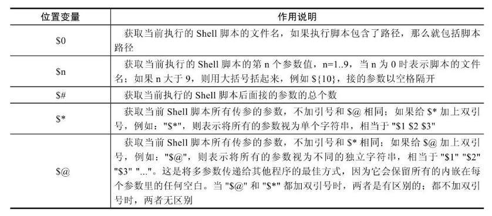

## 第3节 Shell变量进阶

### 1. 将命令结果赋值给变量

对需要获取命令结果的变量内容赋值的常见方法有两种：

~~~
变量=`ls`
变量=$(ls)
~~~

~~~
a=`ls`
echo $a
~~~

生产场景中把命令的结果作为变量的内容进行赋值的方法在脚本开发时很常见。

注意，在变量名前加\$可以取得该变量的值，使用echo命令可以显示变量的值，\$A和${A}的写法不同，但效果是一样的。

当变量后面连接有其他字符的时候，必须给变量加上大括号{}，例如：\$dbname_tname就要改成${dbname}_tname

### 2.特殊变量

在Shell中存在一些特殊且重要的变量，例如：\$0、\$1、$#，我们称之为特殊位置参数变量。

要从命令行、函数或脚本执行等处传递参数时，就需要在Shell脚本中使用位置参数变量。

#### $n

编写如下的p.sh脚本，内容如下：

~~~
echo $1 $2
~~~

执行测试

~~~
bash p.sh hello world
~~~

在脚本中快速生成多个变量

~~~shell
echo \${1..15} #相当于  echo $1 ...  $15
~~~

生成26个英文字母

~~~
echo {a..z}
~~~

测试脚本

~~~
bash p.sh {a..z} # 传入英文字母
~~~

当位置参数数字大于9时，需要用大括号将数字括起来，如：${10}，否则会出现异常

#### $0

$0的作用为取出执行脚本的名称（包括路径）

编写如下的n.sh脚本，内容如下：

~~~
echo $0
~~~

不带路径执行脚本，那么输出结果就是脚本的名字，若使用全路径执行脚本，那么输出结果就是全路径加上脚本的名字

此时如果希望单独获取名称或路径，则可用dirname及basename命令

~~~
dirname /opt/server/a.txt
basename /opt/server/a.txt
~~~

利用$0和上述命令（dirname、basename）分别取出脚本名称和脚本路径。

~~~
dirname $0
basename $0
~~~

#### $\#

通过$#获取脚本传参的个数，编写如下的q.sh脚本，内容如下：

~~~
echo \${1..9} > q.sh
echo $#
~~~

测试

~~~
bash q.sh {a..z}
~~~

利用$#，可以根据用户在命令行的传参个数判断用户的输入，不合要求的给予提示并退出。

#### \$＊和$@

利用set设置位置参数（同命令行脚本的传参）。

~~~shell
set -- zhangsan lisi wangwu # --表示清除所有的参数变量，重新设置后面的参数变量
echo $# #输出参数个数 3
echo $1 #zhangsan
...
~~~

测试\$*和$@，注意，此时不带双引号：

~~~shell
echo $*
echo $@
for i in $*; do echo $i; done
for i in $@; do echo $i; done
~~~

测试"\$*"和"$@"，注意，此时带有双引号：

~~~shell
echo "$*"
echo "$@"
for i in "$*"; do echo $i; done
for i in "$@"; do echo $i; done
~~~

#### \$?

\$?用于获取执行上一个指令的执行状态返回值，0表示成功，非0表示失败

重复创建一个目录测试$0

~~~
mkdir a
echo $0
mkdir a
echo $0
~~~

### 3.内置变量命令

bash Shell包含一些内置命令。这些内置命令在目录列表里是看不见的，它们由Shell本身提供。常用的内部命令有：echo、eval、exec、export、read、shift。下面简单介绍几个最常用的内置命令的格式和功能。

#### echo

echo在屏幕上输出信息，命令格式：

~~~shell
echo args # 将echo命令后面args指定的字符串及变量等显示到标准输出
~~~

#### eval

eval，当Shell程序执行到eval语句时，Shell读入参数args，并将它们组合成一个新的命令，然后执行。命令格式：

~~~
eval args
~~~

创建noeval.sh，内容如下：

~~~shell
echo \$$# # $#代表传入的参数个数
~~~

测试

~~~shell
bash noeval.sh arg1 arg2 # 传入了两个参数，因此$#为2，最后输出$2，但并没有输出arg2
~~~

创建eval.sh，内容如下：

~~~shell
eval "echo \$$#"  #加上eval命令后，使得打印的特殊位置参数重新解析输出，而不是输出$2本身
~~~

