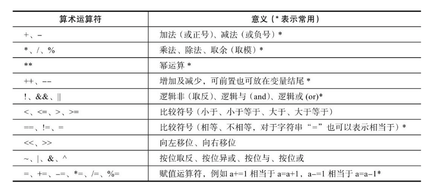
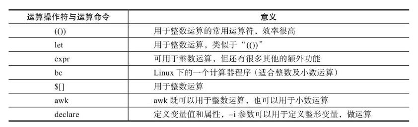
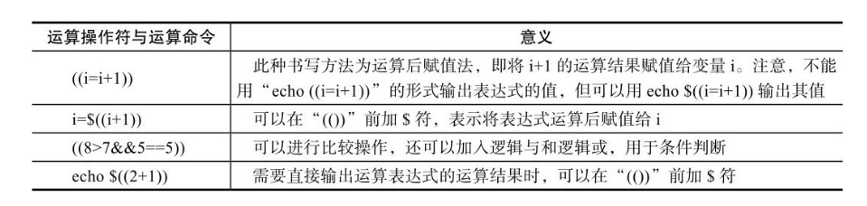
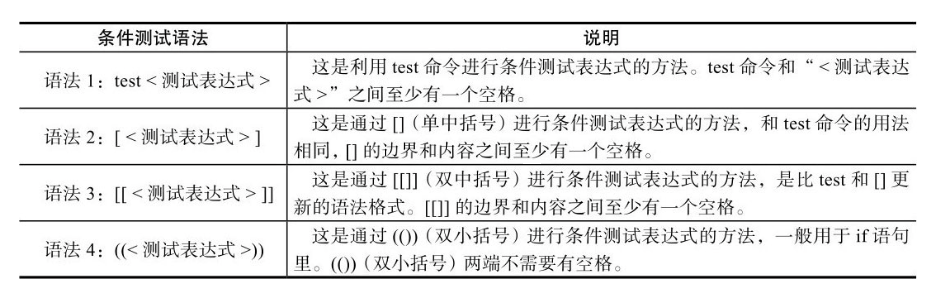
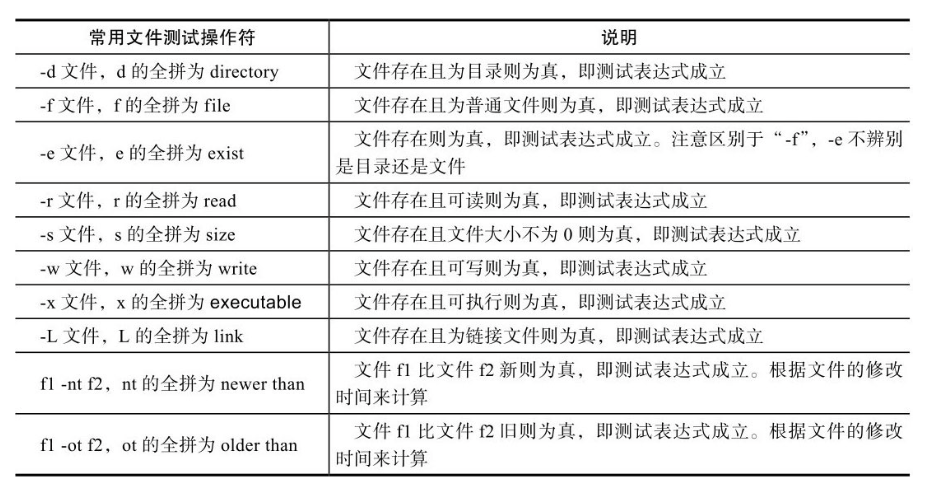
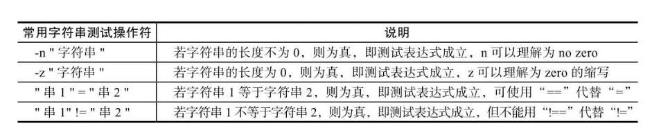
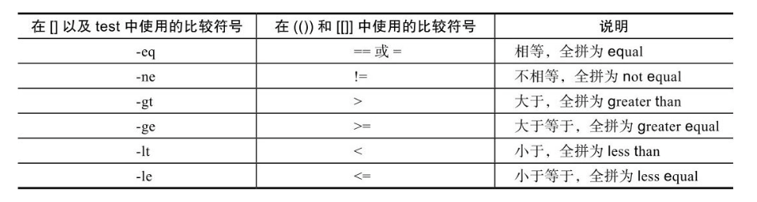
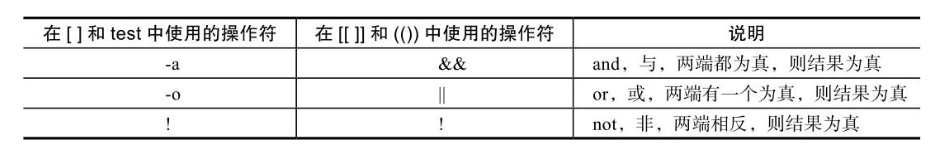
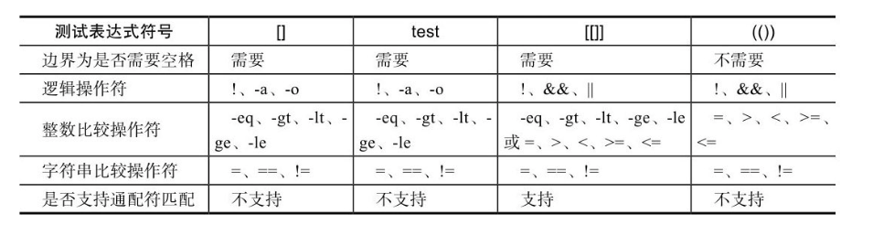

## 第4节 Shell运算符与条件测试

### 1. 算术运算符

如果要执行算术运算，就会离不开各种运算符号，和其他编程语言类似，Shell也有很多算术运算符

算术运算符号均适用于常见的运算命令，常见算术运算命令如下：

#### ”(())”数值运算

双小括号“(())”的作用是进行数值运算与数值比较，它的效率很高，用法灵活，是企业场景运维人员经常采用的运算操作符

利用“(())”进行简单的数值计算。

~~~shell
echo $((1+1)) # 2
i=5
((i=i*2)) # 对i乘2，再赋值给i，此时没有输出，在“(())”中使用变量时可以去掉变量前的$符号。
echo $i
((a=1+2**3-10))
echo $a
b=$((1+2*3))
echo $b
echo $((1+10)) # 注意不能缺少$
echo $((a+=1))
~~~

利用“(())”双括号进行比较及判断。

~~~shell
echo $((8>10)) # 输出结果为0或1
echo $((8==8&&3>2))
~~~

上面涉及的数字及变量必须为整数（整型），不能是小数（浮点数）或字符串。后面的bc和awk命令可以用于进行小数（浮点数）运算，但一般用到的较少.

- (())”表达式在命令行执行时不需要加\$符号，直接使用((6%2))形式即可，但是如果需要输出，就要加\$符，例如：echo $((6%2))

- (())”里的所有字符之间没有空格、有一个或多个空格都不会影响结果。

$(())也可以使用\$[]代替

#### let运算命令

let运算命令的语法格式为：

~~~
let 赋值表达式
~~~

let赋值表达式的功能等同于“((赋值表达式))”。

~~~shell
i=2
i=i+8 # 不使用let进行赋值
echo $i # i+8
unset i
i=2
let i=i+8 # 使用let赋值
echo $i
~~~

let i=i+8等同于((i=i+8))，但后者效率更高。

#### expr命令

expr（evaluate（求值）expressions（表达式））命令既可以用于整数运算，也可以用于相关字符串长度、匹配等的运算处理。

 expr用于计算

~~~
expr 2 + 2
expr 10 \* 5
~~~

要注意，在使用expr时:

- 运算符及用于计算的数字左右都至少有一个空格，否则会报错。
- 使用乘号时，必须用反斜线屏蔽其特定含义，因为Shell可能会误解星号的含义。

expr在Shell中可配合变量进行计算，但需要用反引号将计算表达式括起来。

~~~shell
i=10
i=`expr $i + 6`
echo $i
~~~

利用expr计算字符串的长度。

~~~shell
name=zhangsan
expr length $name
~~~

#### awk实现计算

利用awk进行运算的效果也很好，适合小数和整数，特别是命令行计算，尤其是小数，运算很精确，好用。

~~~shell
echo "7.5 2.5" | awk '{print ($1-$2)}' # $1为第一个数字，$2为第2个数字，用空格隔开
~~~

### 2. 条件测试

通常，在bash的各种条件结构和流程控制结构中都要进行各种测试，然后根据测试结果执行不同的操作，有时也会与if等条件语句相结合，来完成测试判断，以减少程序运行的错误。

执行条件测试表达式后通常会返回“真”或“假”，就像执行命令后的返回值为0表示真，非0表示假一样。

在bash编程里，条件测试常用的语法形式见表：

- 语法1中的test命令和语法2中的[]是等价的。语法3中的[[]]为扩展的test命令，语法4中的(())常用于计算

- 在[[]]（双中括号）中可以使用通配符等进行模式匹配，这是其区别于其他几种语法格式的地方。

- &&、||、＞、＜等操作符可以应用于[[]]中，但不能应用于[]中，在[]中一般用-a、-o、-gt（用于整数）、-lt（用于整数）代替上述操作符。
- 对于整数的关系运算，也可以使用Shell的算术运算符(())

#### test条件测试

test条件测试的语法格式为：

~~~
test ＜测试表达式＞
~~~

对于如下语句：

~~~shell
test -f file && echo true || echo false
~~~

该语句表示如果file文件存在，则输出true，否则（||）输出false，这里的&&是并且的意思。test的-f参数用于测试文件是否为普通文件，test命令若执行成功（为真），则执行&&后面的命令，而||后面的命令是test命令执行失败之后（为假）所执行的命令。

test命令测试表达式的逻辑也可以用上述表达形式的一半逻辑（即仅有一个&&或||）来测试，示例如下。

~~~shell
test -f xxx && echo 1 # 若表达式成功，则输出1
test -f xxx || echo 0 # 若表达式不成功，则输出0
~~~

在test命令中使用-z选项（如果测试字符串的长度为0，则表达式成立）测试字符串。

~~~shell
test -z hello && echo 1 || echo 0 # 如果测试的字符串长度为0，则输出1
~~~

关于test测试表达式的更多知识可执行man test查看帮助，大部分场景都会使用[]的语法替代test命令的语法。

####  []（中括号）条件测试

[]条件测试的语法格式为：

~~~
[ ＜测试表达式＞ ]
~~~

中括号内部的两端要有空格，[]和test等价，即test的所有判断选项都可以直接在[]里使用。

~~~shell
[ -f /tmp/xx ] && echo 1 || echo 0
~~~

#### [[]]条件测试

[[]]条件测试的语法格式为：

~~~
[[ ＜测试表达式＞ ]]
~~~

双中括号里的两端也要有空格。

~~~shell
[[ -f /tmp/xx ]] && echo 1 || echo 0
~~~

在[[ ]]中可以使用通配符等进行模式匹配；并且&&、||、＞、＜等操作符可以应用于[[ ]]中，但不能应用于[ ]中，在[ ]中一般使用-a、-o、-gt（用于整数）、-lt（用于整数）等操作符代替上文提到的用于[[]]中的符号。

#### 文件测试表达式

这些操作符号对于[[]]、[]、test的测试表达式是通用的

#### 字符串测试操作符

字符串测试操作符的作用包括：比较两个字符串是否相同、测试字符串的长度是否为零、字符串是否为NULL等

- 对于字符串的测试，一定要将字符串加双引号之后再进行比较
- 比较符号（例如=和！=）的两端一定要有空格

~~~shell
name=zhangsan
[ -n "$name" ] && echo 1 || echo 0 # 注意此处变量两侧也要有引号，否则会出现判断错误
[ "abc" = "ac" ] && echo 1 || echo 0 # 注意等号两侧要有空格，使用=或==均可
~~~

字符串比较时若等号两端没有空格，则会导致判断出现逻辑错误，即使语法没问题，但是结果依然可能不对。

#### 整数二元比较操作符

在书写测试表达式时，可以使用表中的整数二元比较操作符。

- =”和“! =”也可在[]中做比较使用，但在[]中使用包含“＞”和“＜”的符号时，需要用反斜线转义，有时不转义虽然语法不会报错，但是结果可能会不对。
- 也可以在[[]]中使用包含“-gt”和“-lt”的符号，但是不建议这样使用。
- 比较符号两端也要有空格。

二元数字在[]中使用“＜”、“＞”非标准符号的比较

~~~shell 
[ 2 > 1 ] && echo 1 || echo 0 # 1
[ 2 < 1 ] && echo 1 || echo 0 # 1 结果错误
[ 2 \< 1 ] && echo 1 || echo 0 # 转义后正确
~~~

二元数字在[]中使用-gt、-le类符号的比较。

~~~shell
[ 2 -gt 1 ] && echo 1 || echo 0
[ 2 -lt 1 ] && echo 1 || echo 0
~~~

二元数字在(())中的比较。

~~~shell
((3>2)) && echo 1 || echo 0
((3<2)) && echo 1 || echo 0
((3==2)) && echo 1 || echo 0
~~~

#### 逻辑操作符

在书写测试表达式时，可以使用表中的逻辑操作符实现复杂的条件测试。

#### 测试表达式test、[]、[[]]、(())的区别总结

