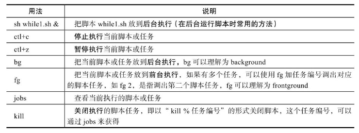

 ## 第6节 循环语句

循环语句命令常用于重复执行一条指令或一组指令，直到条件不再满足时停止，Shell脚本语言的循环语句常见的有while、until、for及select循环语句。while循环语句主要用来重复执行一组命令或语句，在企业实际应用中，常用于守护进程或持续运行的程序，除此以外，大多数循环都会用后文即将讲解的for循环语句。

### 1.while循环

while循环语句的基本语法为：

~~~shell
while <条件表达式>
do
	指令
done
~~~

while循环语句会对紧跟在while命令后的条件表达式进行判断，如果该条件表达式成立，则执行while循环体里的命令或语句（即语法中do和done之间的指令）.

每一次执行到done时就会重新判断while条件表达式是否成立，直到条件表达式不成立时才会跳出while循环体。如果一开始条件表达式就不成立，那么程序就不会进入循环体.

until循环语句的语法为：

~~~shell
until <条件表达式>
do
	指令
done
~~~

until循环语句的用法与while循环语句的用法类似，区别是until会在条件表达式不成立时，进入循环执行指令；条件表达式成立时，终止循环。until的应用场景很罕见，了解下即可.

每隔2秒输出一次系统负载（负载是系统性能的基础重要指标）情况，`uptime`命令用于显示系统总共运行了多长时间和系统的平均负载。

 `uptime `命令会显示一行信息，依次为：当前时间、系统已经运行了多长时间、目前有多少[用户](https://www.elecfans.com/v/user/)登录、系统在过去的 1 分钟、5 分钟和 15 分钟内的平均负载。输出结果等同于 top 命令汇总区的第一行。

创建uptime-demo.sh

~~~shell
while true # 条件用于为真，会一直运行
do
	uptime
	sleep 2 # 让程序暂停2秒，控制循环的频率，否则会消耗大量的系统资源
done
~~~

改进程序，将负载值追加到log里

~~~shell
while [ 1 ] # 使用条件表达式表示条件为真
do
	uptime >>/tmp/uptime.log # 将信息输入到log文件中
	sleep 2
done
~~~

### 2. 脚本后台运行

通过在脚本的结尾使用&符号来在后台运行脚本：

~~~shell
bash uptime-demo.sh &
tail -f /tmp/uptime.log # 使用tail命令实时观察结果
~~~

在实际工作中，一般会通过客户端SSH连接服务器，因此可能就会有在脚本或命令执行期间不能中断的需求，下面是防止脚本执行中断的几个可行方法：

- 使用bash /server/scripts/while_01.sh &命令，即使用&在后台运行脚本。

- 使用nohup /server/scripts/uptime.sh &命令，即使用nohup加&在后台运行脚本。

创建test.sh脚本测试

~~~shell
while true # 条件用于为真，会一直运行
do
	uptime
	sleep 2 # 让程序暂停2秒，控制循环的频率，否则会消耗大量的系统资源
done
~~~

~~~shell
bash test.sh #前台运行脚本
     13:14:48 up  1:27,  1 user,  load average: 0.00, 0.01, 0.05
     13:14:50 up  1:27,  1 user,  load average: 0.00, 0.01, 0.05
     ..
^C # 使用ctrl+c关闭程序
bash test.sh & #后台运行脚本
	[1] 7534
fg # 执行fg命令，将脚本放到前台执行
^Z # 使用ctrl+z，暂停脚本执行
	[1]+  已停止               bash test.sh
bg # 将脚本放到后台执行
jobs # 查看当前shell下运行的脚本任务
	[1]+  运行中               bash test.sh &
fg 1 # 使用fg+编号调出程序
^C # 使用ctrl+c关闭程序
~~~

### 3. for循环

for循环语句和while循环语句类似，但for循环语句主要用于执行次数有限的循环，而不是用于守护进程及无限循环

第一种for循环语句为变量取值型，语法结构如下：

~~~shell
for 变量名 in 变量取值列表
do
	指令
done
~~~

在此结构中“in变量取值列表”可以省略，省略时相当于in“\$@”，也就是使用for i就相当于使用for i in “$@”

在这种for循环语句语法中，for关键字后面会有一个“变量名”，变量名依次获取in关键字后面的变量取值列表内容.，每次仅取一个，然后进入循环（do和done之间的部分）执行循环内的所有指令，当执行到done时结束本次循环。之后，“变量名”再继续获取变量列表里的下一个变量值，继续执行循环内的所有指令，当执行到done时结束返回，以此类推，直到取完变量列表里的最后一个值并进入循环执行到done结束为止。

第二种for循环语句称为C语言型for循环语句，其语法结构如下：

~~~shell
for ((exp1;exp2;exp3))
do
	指令
done
~~~

for关键字后的双括号内是三个表达式，第一个是变量初始化（例如：i=0），第二个为变量的范围（例如：i＜100），第三个为变量自增或自减（例如：i++）。

当第一个表达式的初始化值符合第二个变量的范围时，就进入循环执行；当条件不满足时就退出循环。

~~~shell
for ((i=1;i<=3;i++))
do
	echo $i
done
~~~

