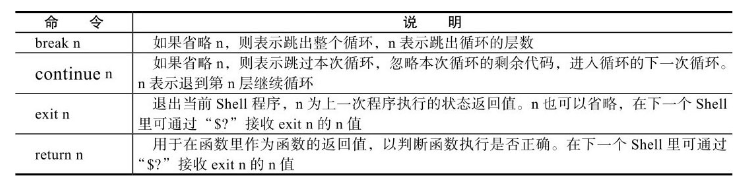
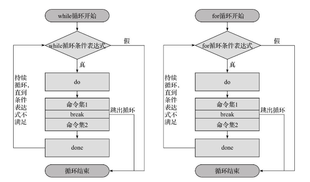
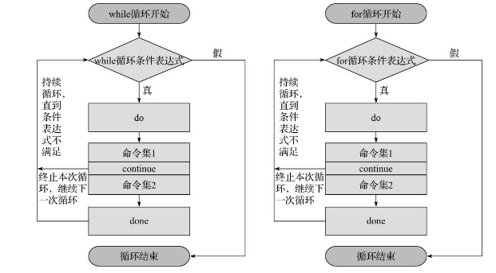
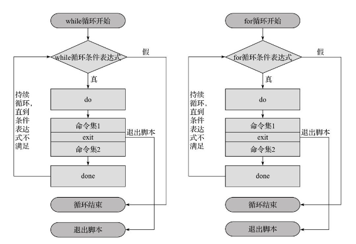

## 第7节 Shell函数

### 1. Shell函数的概念

函数的作用就是将程序里多次被调用的相同代码组合起来（函数体），并为其取一个名字（即函数名），其他所有想重复调用这部分代码的地方都只需要调用这个名字就可以了。当需要修改这部分重复代码时，只需要改变函数体内的一份代码即可实现对所有调用的修改，也可以把函数独立地写到文件里，当需要调用函数时，再加载进来使用。inux系统里的近2000个命令可以说都是Shell的函数。

使用Shell函数的优势如下：

- 把相同的程序段定义成函数，可以减少整个程序的代码量，提升开发效率。
- 增加程序的可读性、易读性，提升管理效率。
- 可以实现程序功能模块化，使得程序具备通用性（可移植性）

下面是Shell函数的常见语法格式。其标准写法为：

~~~shell
function 函数名() {
	指令
	return n
}
~~~

简化写法1：

~~~shell
function 函数名 {
	指令
	return n
}
~~~

简化写法2:

~~~shell
函数名 {
	指令
	return n
}
~~~

### 2. 执行与调用

Shell的函数分为最基本的函数和可以传参的函数两种，其执行方式分别说明如下。1）执行不带参数的函数时，直接输入函数名即可（注意不带小括号）。

~~~
函数名
~~~

- 执行Shell函数时，函数名前的function和函数后的小括号都不要带。
- 函数的定义必须在要执行的程序前面定义或加载。
- Shell执行系统中各种程序的执行顺序为：系统别名→函数→系统命令→可执行文件。
- 函数执行时，会和调用它的脚本共用变量，也可以为函数设定局部变量及特殊位置参数。
- 在Shell函数里面，return命令的功能与exit类似，return的作用是退出函数，而exit是退出脚本文件。
- return语句会返回一个退出值（即返回值）给调用函数的当前程序，而exit会返回一个退出值（即返回值）给执行程序的当前Shell。

- 如果将函数存放在独立的文件中，被脚本加载使用时，需要使用source或“.”来加载。
- 在函数内一般使用local定义局部变量，这些变量离开函数后就会消失。

带参数的函数执行方法，格式如下：

~~~shell
函数名 参数1 参数2
~~~

- Shell的位置参数（\$1、\$2…、\$#、\$*、\$？及$@）都可以作为函数的参数来使用。
- 此时父脚本的参数临时地被函数参数所掩盖或隐藏。
- $0比较特殊，它仍然是父脚本的名称。
- 函数执行完成时，原来的命令行脚本的参数即可恢复。

开发脚本建立简单函数并调用执行

~~~shell
function f1(){
	echo "call f1"
}
f1
~~~

务必要先定义函数然后再执行函数，否则会报错

分离函数体和执行函数的脚本文件，创建functions.sh脚本

~~~shell
function f1(){
	echo "call f1"
}
~~~

然后开发执行脚本以调用上述函数。

~~~shell
# 判断脚本文件是否存在，如果存在则加载
[ -f /opt/scripts/functions.sh ] && . /opt/scripts/functions.sh || exit 1
# 调用函数
f1
~~~

调用函数时，传递参数

~~~sheLl
function f2(){
	echo "call f2 arg=$1"
}
# 调用
f2 hello
~~~

也可以通过脚本的位置参数传递，创建f2.sh，并加入以下内容：

~~~shell
function f2(){
	echo "call f2 arg=$1"
}
f2 $1
~~~

执行脚本

~~~
bash f2 hello
~~~

### 3. break、continue、exit、return的区别

在上述命令中:

- break、continue在条件语句及循环语句（for、while等）中用于控制程序的走向；

- exit则用于终止所有语句并退出当前脚本，除此之外，exit还可以返回上一次程序或命令的执行状态值给当前Shell;
- return类似于exit，只不过return仅用于在函数内部返回函数执行的状态值。

break功能

continue功能

循环中exit功能的执行流程

