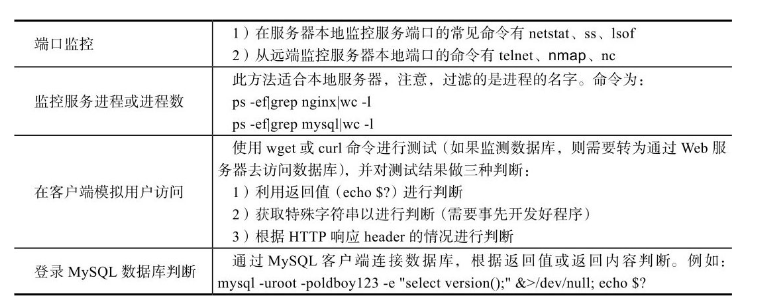

## 监控Web和数据库的运行状态

### 1. 概述

使用if条件语句针对Nginx Web服务或MySQL数据库服务是否正常进行检测，如果服务未启动，则启动相应的服务。监控Web服务和MySQL数据库服务是否异常的方法如下：

对端口进程等进行判断时，先通过grep过滤端口和进程特殊标记字符串，然后结合wc将过滤到的结果转成行数再比较，这样相对简单有效，且经过wc -l命令处理之后的结果一定是数字，这样再进行判断就会比较简便。

### 2. 监测MySQL数据库异常

1. MySQL数据库环境准备

~~~shell
yum install mysql-server -y
systemctl start mysqld
~~~

2. 通过命令行检测数据库服务是否正常，只有先确定命令行是正确的，才能确保将它放到脚本里也是正确的，首先采用端口监控的方式。在服务器本地监控端口的命令有netstat、ss、lsof等

~~~shell
netstat -lntup|grep mysql|wc -l
ss -lntup|grep mysql|wc -l # 类似于netstat 参数选项通用
lsof -i tcp:3306|wc-l # 检查tcp协议的3306端口
~~~

从远端监控服务器监控本地端口的命令有telnet、nmap、nc，这三个命令有可能需要事先安装好才能使用，这里演示nmap：

~~~shell
yum install nmap -y
nmap 127.0.0.1 -p 3306|grep open|wc -l # 查看远端3306端口是否开通，过滤open关键字，如果返回1，说明端口是打开的
~~~

3. 开发监控MySQL数据库的脚本

~~~shell
if [ `netstat -lntup|grep mysqld|wc -l` -gt 0 ]; then
	echo "MySQL is Running"
else
	echo "MySQL is Stopped"
	systemctl start mysqld
fi
~~~

### 3. 监控Nginx Web服务异常

监控Nginx Web服务异常的方法和监控MySQL数据库一样，也是使用端口、进程进行检测

1. Nginx web服务环境准备

~~~shell
yum install nginx -y
systemctl start nginx
~~~

2. 通过命令行检测Nginx服务是否正常,采用端口监控的方式

~~~shell
netstat -lntup|grep -w 80|wc -l
~~~

在远端监控服务器本地端口

~~~shell
nmap 127.0.0.1 -p 80|grep open|wc -l
~~~

开发监控Nginx Web服务的脚本

~~~shell
if [ `netstat -lntup|grep nginx|wc -l` -gt 0]; then
	echo 'Nginx is Runing'
else
	echo "Nginx is Stopped"
	systemctl start nginx
fi
~~~

